:::tip[Under Construction]
:::

# Introduction

### How to Think About AstroImageJ

AstroImageJ (AIJ) is software designed for extracting photometry from astronomical images, as well as everything in between: from image calibration to exporting a light curve. It eliminates the need for any other software to perform these tasks. AIJ was created primarily for precise work with ground-based photometric observations of exoplanet transits. For exoplanet transit work, AIJ not only produces precise light curves but also allows fitting transit models to them. However, AIJ does not, for example, return uncertainties of the fitted transit parameters.

This illustrates how the software should be viewed—it is meant for obtaining highly precise light curves, performing detailed inspection of the data, and exporting the results to other tools used, for instance, to jointly determine planetary and orbital parameters from both ground- and space-based photometry. Its graphical user interface is exceptionally comprehensive and interactive, capable of visualizing nearly every aspect of time-series photometry. Users can directly see how each processing step affects the data and, in a sense, “feel” their light curves while working with them.

AIJ can, of course, also be used for variable stars (such as eclipsing binaries) and objects like asteroids. For example, it allows exporting measurements in a format accepted by the American Association of Variable Star Observers (AAVSO) database. AIJ is the standard tool in the [TESS Follow-up Observing Program Subgroup 1](https://tess.mit.edu/followup/).

### Installation & Updates
Up-to-date installation files for Linux, macOS, and Windows are available on [the main page of the official AstroImageJ website](https://astroimagej.com/).

By default, AIJ notifies you at startup when a new version is available. To update manually or switch to an older build, open AIJ and navigate to AIJ toolbar → `Help` → `Update AstroImageJ`. Choose a build from the pull-down menu (the daily build is selected by default), click `OK`, then AIJ downloads and installs it automatically. AIJ closes when the install finishes, and the next launch uses the version you selected.

# AstroImageJ Toolbar
When AIJ is launched, the AIJ toolbar appears, as shown in **Figure 1**. On the right side of the toolbar, you will find eight AIJ-specific icons, starting with the icon shown in the pressed (depressed) state below. Above the icons are the menus: `File`, `Edit`, `Image`, `Process`, `Analyze`, `Plugins`, `Window`, and `Help`. However, for typical AIJ use, only the `File` menu is generally useful, as it provides options for opening images. Image opening in AIJ is discussed in the next section.

<figure style="text-align:center">
  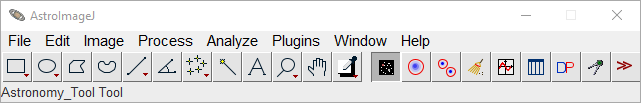">
  <figcaption><strong>Figure 1.</strong> AstroImageJ Toolbar</figcaption>
</figure>

The toolbar functions similarly to that of generic ImageJ (IJ), but for most AIJ operations, you will want the  icon selected, as shown. The corresponding mode is referred to as `Astro-Mode` throughout this guide. AIJ starts in this mode by default.

A brief overview of each toolbar icon is provided below.

 **Astro-Mode Icon** — this button should typically stay selected (pressed) during normal AIJ use. If it is deselected, the mouse, keyboard, and image display revert to standard ImageJ behavior. The button can deselect automatically if you use a base ImageJ toolbar icon to draw a Region of Interest (ROI), such as a square or circle. ROIs are not usually required for AIJ tasks, but they can be useful for custom measurements. After drawing an ROI, be sure to reselect the astro-mode icon to return to astro-mode. Clicking other AIJ-specific toolbar icons does not change the astro-mode state.

 **Single Aperture Photometry Icon** — when selected, this tool enables single-aperture photometry by simply left-clicking on the desired location within an image. If the centroid feature is enabled, the aperture will automatically snap to the nearest centroid. The resulting photometry data is output to a measurements table, which can then be plotted or saved to disk. Single-aperture photometry can also be performed—even if this icon is not active—by holding the `Shift` key while left-clicking on the image.

 **Multi-Aperture Photometry Icon** — opens the `Multi-Aperture` photometry module, which is used to perform differential photometry on a series of images—typically ones that have already been calibrated. The `Multi-Aperture` tool generates a table containing photometry results. This tool is also accessible from the toolbar above image display in the `Image Display` window.

 **Clear Overlay Icon** — removes all annotations and apertures from the image overlay.

 **Multi-Plot Icon** — opens the `Multi-Plot` module, which allows you to plot multiple curves on a single graph using data from the table generated by `Multi-Aperture` or any other compatible table loaded from disk.

 **Measurement Table Icon** — opens a previously saved measurements table, or any generic file that is tab-, comma-, space-, or whitespace-delimited, from disk. Alternatively, a data file can be opened by dragging and dropping it onto either of the two `Multi-Plot` control panels.

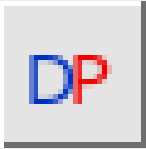 **Data Processor Icon** — opens the `Data Processor` (DP) module, which can:
- perform image calibration, including bias, dark, flat, and linearity correction;
- update FITS headers with additional data;
- perform plate-solving to add WCS data to FITS headers (requires internet access and a free user key from [nova.astrometry.net](https://nova.astrometry.net));
- run the `Multi-Aperture` and `Multi-Plot` tools after each image is calibrated;
- operate in real-time mode during observations.

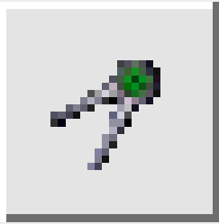 **Coordinate Converter Icon** — opens the Astronomical Coordinate and Time Converter module, which converts time for specified sky coordinates and an observing location to and from various time systems, including UTC, local time, Local Sidereal Time (LST), Julian Date (JD), Heliocentric JD (HJD), and Barycentric JD (BJD TBD). The module also provides information on the lunar phase, as well as the angular proximity of the Moon and all major planets in the solar system.

 **More Tools Icon** — this option allows the user to modify the toolset available on the AIJ Toolbar.

## Importing Images into AstroImageJ
To open a single image in AstroImageJ, either double-click the file in your operating system (if AIJ is set as the default application for opening FITS and/or other image files), select `File` → `Open` from the AIJ toolbar, or drag and drop the image directly onto the toolbar.

Image sequences can be opened as an AIJ *stack* using the toolbar menu option `File` → `Import` → `Image Sequence`. The `Import Image Sequence` dialog that opens (**Figure 2**) defines how a series of image files in a folder will be loaded as a single stack in AIJ.

<figure style="text-align:center">
  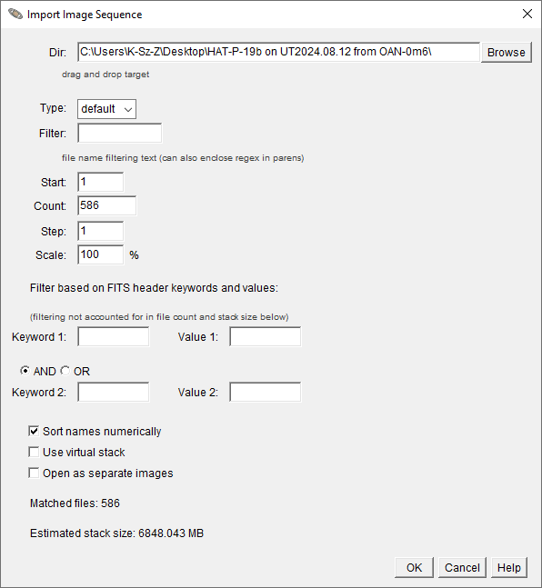">
  <figcaption><strong>Figure 2.</strong> Import Image Sequence window</figcaption>
</figure>

The `Dir` field specifies the folder path. The `Type` dropdown selects the image format for import: `default` (use the file’s native type), `16-bit`, `32-bit`, or `RGB`. Directly below, the `Filter` field can limit which files are loaded by matching part of their names or a regular expression pattern. The `Start`, `Count`, and `Step` fields control which files in the sequence are included, while `Scale` determines the fraction of the original image size used when the stack is opened. Entering a value below `100` in `Scale` reduces the memory required to open the image stack. For instance, setting `Scale` to `50%` should lower memory use by approximately 75%. However, this option will not work with some image formats, including FITS, so leaving this parameter at `100%` is generally the safest choice.

The `Filter based on FITS header keywords and values` section can further restrict images based on metadata in their FITS headers, using either an `AND` or `OR` condition between two keyword–value pairs.  

At the bottom, several options determine how the stack is created:  
- `Sort names numerically` ensures numbered files load in natural numerical order (1, 2, 3 … 10 rather than 1, 10, 2 …).  
- `Use virtual stack` loads only one image at a time into memory, minimizing RAM use. This option is recommended when the total estimated stack size exceeds the memory allocated to Java on your machine. Because only one image is loaded at a time, photometry operations run somewhat slower, as each image must be read from disk when accessed. When memory allows, leaving `Use virtual stack` unchecked enables faster photometry, since all images are held in memory and can be processed repeatedly without delay. **NOTE:** You can allocate more memory for AstroImageJ via `AIJ Toolbar` → `Edit` → `Memory & Threads`.  
- `Open as separate images` opens each file individually instead of as a single stack.

The `Matched files` line shows how many images meet the selection criteria, and the `Estimated stack size` reports the total memory requirement. Clicking `OK` loads the selected images into AIJ as a stack.

If images are opened as a stack, they will be displayed in a single window as shown in Figure 3, with an additional stack control bar inserted between the image and the histogram display (see Figure 3).

The stack slider can be dragged left or right to move through the images. You can also use the left and right arrow buttons to step through the images one at a time. Similarly, the left and right arrow keys on your keyboard will move through the stack. To play the stack as an animation, click the `play` button 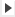. Right-clicking the `play` icon opens a menu where you can adjust animation speed and other playback settings.

To delete the currently displayed image from the stack (i.e., the current slice), click the `delete currently displayed slice from stack` icon  above the image. This removes the image only from AIJ memory—it is not deleted from the disk. Note that this feature will not remove the last two images in a stack.

# AstroImageJ Image Display Interface
When a FITS image or any other supported image type is opened, the image will be displayed in a window as shown in **Figure 3**.

<figure style="text-align:center">
  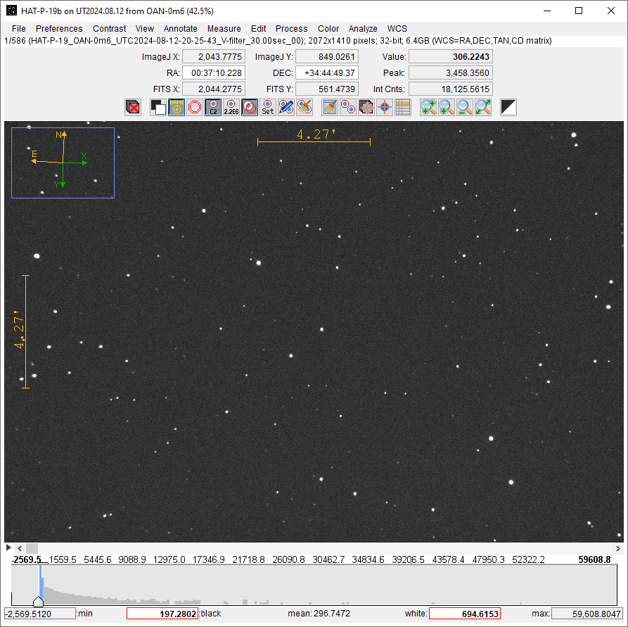">
  <figcaption><strong>Figure 3.</strong> AstroImageJ Image Display interface</figcaption>
</figure>

---

### Panning & Zooming
To pan the image, left-click and drag the mouse. A middle mouse click will center the image on the clicked location (if this option is enabled in the `Preferences` menu in the `Image Display` window).

If your mouse has a scroll wheel, you can use it to zoom in and out of the image. Place the cursor at the point where you want to zoom, and scroll the wheel to zoom in or out. If no mouse wheel is available, click on the image at the desired location and use the `zoom in`  and `zoom out`  buttons above the image. You can also hold the `Ctrl` key and left-click to zoom in, or `Ctrl` and right-click to zoom out. To zoom quickly, press the `zoom-in fast` button  above the image or double left-click to zoom in rapidly. To zoom out quickly, right-click twice on the image. This will fit the image view to the current window.

To fit the entire image to the display window, use the `zoom to fit image to window` icon  above the image. Triple right-clicking will also zoom out to show the full image, though this may result in blank space at the edges of the display.

Keyboard shortcuts are also available: pressing the up arrow or `+` key zooms in, while the down arrow or `-` key zooms out.

---

### Contrast/Brightness Adjustment
AIJ offers several ways to adjust image brightness and contrast, depending on your preferences and analysis needs.

The easiest method is to use the `Auto brightness & contrast` button  located above the image. This default setting automatically scales the image display based on a constant factor multiplied by the standard deviation of the pixel values. If the default result is not ideal, you can adjust the scaling factors using the `Set auto brightness & contrast parameters` option in the `Contrast` menu, or automatically apply the current histogram settings using `Grab auto brightness & contrast from histogram`.

You can manually adjust the display using the histogram located below the image. The blue region of the histogram represents the currently displayed range of pixel values. You can drag the edges of this region to modify brightness and contrast. The pixel value corresponding to black appears in the “black” box, and the value for white appears in the “white” box. These values can also be entered manually by clicking on the number, typing a new value, and pressing `Enter`.

The `Contrast` menu offers four display modes:
- `Auto brightness & contrast` – Automatically scales the display based on pixel value statistics.
- `Fixed brightness & contrast` – Maintains the same user-defined settings across all images.
- `Fixed brightness & contrast (per image slice)` – Keeps separate brightness and contrast settings for each slice in a stack or time series.
- `Full dynamic range` – Displays the entire range of pixel values in the image.

The selected mode is saved and automatically applied when new images are opened or when a new slice is displayed in a stack.

In all modes, the “black” and “white” boxes can be edited manually. However, in auto mode, these values will reset automatically when the image changes.

The histogram's minimum and maximum values are set to the actual pixel range of the current image. If you want to lock these values across images, enable `Use fixed min and max histogram values` in the `Scale` menu.

To return to the default auto-scaling behavior at any time, choose `Reset auto brightness & contrast to defaults` from the `Contrast` menu.

---

### Image Negative
AIJ can display an image as a negative by selecting the `display as image negative` icon  located above the image display. This mode uses an inverting lookup table to alter the display without changing the actual image data. In this mode, high pixel values are shown as black, and low pixel values are shown as white.

---

### Image Invert (Flip) and Rotate
Images displayed in the `Image Display` window can be flipped along the X- or Y-axis and/or rotated by 0 or 180 degrees using options in the `View` menu above the image. These options affect only how the image is displayed—they do not modify the actual image data in memory. To flip or rotate the underlying image itself, use the `Flip and Rotate` options in the `Process` menu.

---

### WCS Data Displayed in the Image Display Overlay
The blue zoom box in the upper-left corner of the image represents the region of the full frame currently shown in the display window. Its size can be adjusted through the `View` menu → `Set zoom indicator size`.

The green `X` and `Y` arrows indicate the pixel coordinate orientation of the original image before any inversion or rotation (see the `View` menu). The `Y` arrow points upward, and the `X` arrow points to the right in the untransformed image.

The `N` (North) and `E` (East) arrows, together with the angular distance scales, form the image orientation overlay:
- When valid WCS headers are present in the FITS file, the overlay appears in yellow, and both direction and scale are automatically determined.  
- When WCS information is absent, the overlay appears in red, and the directions and scale must be manually defined using the `WCS` menu.

The display of the zoom box, pixel coordinate arrows (`X` and `Y`), celestial direction arrows (`N` and `E`), and the scale indicators can each be independently toggled in the `View` menu.

---

### Data Displayed Above the Image
AIJ includes a live photometer that tracks the mouse pointer across the image. As the cursor moves, data fields above the image update in real time to show photometric and positional information corresponding to the current pointer location.

Three coordinate systems are shown in the fields above the image display:
- ImageJ (IJ) native pixel coordinates — the origin (0,0) is at the top-left corner, with x increasing to the right and y increasing downward. These coordinates are useful when working with built-in IJ features.
- If WCS headers are available from a FITS file, Right Ascension and Declination are displayed in the middle line.
- FITS standard pixel coordinates — the origin is at the bottom-left, with x increasing to the right and y increasing upward. These coordinates are commonly used in astronomy, especially when working with images that include World Coordinate System (WCS) headers.

In the right part of the interface:
- The `Value` field shows the pixel value directly under the mouse cursor.
- The `Peak` field shows the highest pixel value within a circular aperture centered at the cursor. If the mean value option is enabled in the `Preferences` menu, this label changes to `Mean`, and the field displays the average pixel value within the aperture.
- The `Int Cnts` (Integrated Counts) field displays the sum of pixel values within the aperture, minus the mean of the pixel values in the background annulus.

The live photometer's aperture radius as well as the inner and outer background annuli, can be configured using the `change aperture settings` button  above the image display, or by navigating to `Edit` menu → `Aperture Settings`. You can also double-click the `Single Aperture Photometry` icon  on the toolbar to open the `Aperture Photometry Settings` window. The display of the photometer can be disabled by unchecking the `Show photometer aperture at mouse cursor` option in the `Preferences` menu.

---

### Finding Your Object of Interest in an Image
To quickly locate a known object in a plate-solved image:
1. Open the plate-solved image in AstroImageJ.
2. Copy the object’s RA and Dec coordinates (e.g., `23:45:67.89 +78:12:56.78`).
3. Paste the coordinates into the `RA` and/or `DEC` fields above the image display.
   AIJ automatically recognizes the coordinate format, so you may paste into just one field if desired.
   Press `Enter` to confirm.
4. A yellow circle will appear at the specified coordinates, marking the object’s position based on the WCS information in the FITS header.

To remove the annotation after drawing, click the `clear apertures and annotations from overlay` icon .

---

### Finding the Pixel Scale of an Image
To check the pixel scale of a (plate-solved) image:
1. Open the plate-solved image in AstroImageJ.
2. In the menu above the displayed image, select `WCS` → `Set pixel scale for images without WCS`.
3. A new window will appear showing the pixel scale of the image in both the X and Y directions.

---

### Measuring Arclength
To measure the angular distance and position angle (PA) between two points in an image, press `Ctrl` and right-click while dragging, or click and drag using the mouse scroll wheel. The measurement vector appears on the image, and the current arclength and PA values are shown along the line and in the information bar above the image display. These values are available only if the pixel scale is defined in the `WCS` menu of the `Image Display` window or if valid WCS headers are present in the FITS file.

While dragging, two labels in the panel above the image display change to reflect the measurement mode:
- The `Peak` (or `Mean`) label changes to `PA` and shows the position angle in degrees.
- The `Int Cnts` label changes to `Length` or `Arclen`:
  - `Length` displays the separation in pixels.
  - `Arclen` displays the separation in arcseconds (or in sexagesimal format, if enabled).

If WCS information is available or a pixel scale has been set manually, the angular separation is displayed. Otherwise, only the distance in pixels and the `Y-axis Angle` are shown instead of the `PA`.

When the mouse button is released, the software automatically places (optionally centroided) apertures at both ends of the vector. The arclength (or pixel distance), position angle (or Y-axis angle), magnitude difference (Δmag), and flux ratio are then displayed along the line. The display of these quantities can be toggled in the `Measure` menu.

You can also choose in the `Measure` menu whether these measurements are recorded in a data table. To remove the measurement overlay after drawing, click the `clear apertures and annotations from overlay` icon .

---

### Other Icons above the Image Display
-  **Clear Table Icon** — clears all data from the measurements table generated by single- or multi-aperture photometry. This is especially useful when running back-to-back Multi-Aperture sessions and you want to quickly remove data from the previous session. **WARNING:** This action cannot be undone.
-  **Multi-Aperture Icon** — opens the `Multi-Aperture` photometry module, which is used to perform differential photometry on a series of (typically already calibrated) images.
-  **Image Alignment Icon** — opens the AIJ `Stack Aligner` module (see the **Stack Aligner** subsection). Images in a stack can be aligned using one of the following methods:
  - Place apertures on one or more reference stars in a designated reference image. The centroids of those stars are then used to align all other images by translating them along the X and Y axes.
  - Use WCS data from the FITS headers (if available) to align each image to the reference automatically (recommended).
-  **Plate-Solve Icon** — opens the AIJ plate solve setup panel. Plate solving requires an internet connection and a free user key from [nova.astrometry.net](https://nova.astrometry.net).
-  **FITS Header Icon** — opens the AIJ `FITS Header Editor` module. This tool allows you to view and edit the FITS header associated with an image. See the next subsection for details.

---

### FITS Header Editor
Information contained in the header of a FITS image opened in AIJ can be displayed and optionally edited by clicking the `FITS Header Editor` icon  above an image display. The `FITS Header Editor` panel shown in **Figure 4** opens. A FITS header consists of keywords with associated value and comment fields. FITS header keywords and values should not be edited unless the user fully understands the potential impact on downstream data interpretation.

<figure style="text-align:center">
  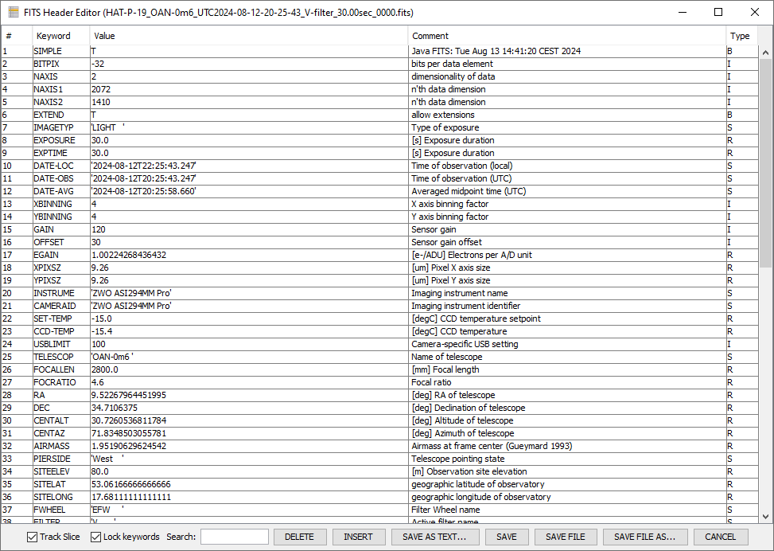">
  <figcaption><strong>Figure 4.</strong> FITS Header Editor interface</figcaption>
</figure>

By default, keyword values are locked. To edit them, deselect the `Lock keywords` checkbox below the table. To modify an entry, double-click inside the corresponding cell and type the new value using the keyboard. To delete a header keyword and its associated value and comment, single-click on a row to highlight it, then click the `DELETE` button. To insert a new row, single-click on a row to highlight it and click the `INSERT` button to add a new entry below the selected row. Double-click each cell in the new row to enter the desired data.

AIJ checks the validity of any modified cell to ensure compliance with the FITS standard. The `Keyword` entry is automatically truncated to the first eight characters and converted to uppercase after pressing `Enter` or clicking another cell. The `Value` entry may contain a string (text enclosed in single quotes), integer, real number, or Boolean (`T` or `F`). The `Type` field is automatically determined by the contents of the `Value` field and cannot be directly edited. The `Comment` field may contain any text string, but will be truncated once the full entry exceeds 80 characters. Truncation occurs when the `SAVE` or `SAVE FILE` buttons are pressed.

Certain rows—specifically those with the keywords `SIMPLE`, `BITPIX`, `NAXIS`, `NAXIS1`, and `NAXIS2`—cannot be edited, as these values are automatically determined by AIJ based on the image’s properties. The `END` keyword must always remain in the last row and is also non-editable.

Two checkboxes are available at the bottom of the panel:
- `Track Slice` updates the `FITS Header Editor` to match the currently selected image slice.
- `Lock keywords` prevents accidental modification of header entries when checked.

The buttons along the bottom of the editor, from left to right, allow the user to:
- `DELETE` the selected row of data (highlighted in blue),
- `INSERT` a new row below the currently selected row,
- `SAVE AS TEXT...` to export the header to a text file,
- `SAVE` the edited header to the image in memory,
- `SAVE FILE` to save both the image and the edited header to disk (and memory) under the same filename,
- `SAVE FILE AS...` to save the image and header under a new filename,
- or `CANCEL` to discard changes and exit the editor.

To undo recent header edits without saving, click `CANCEL` and reopen the FITS header in the editor if needed. To apply changes to the image in memory, press `SAVE`. To retain the changes permanently, the image must then be saved to disk using either the `File` menu in the `Image Display` window or the `File` menu in the AIJ toolbar. Alternatively, the `SAVE FILE` button directly writes the updated header and image to both memory and disk. **WARNING:** Using `SAVE FILE` also writes any pixel data changes made to the image.

---

### Stack Aligner

The images within a stack can be aligned using the **Image Alignment** icon  above an image stack. The `Stack Aligner` panel shown in **Figure 5** opens and provides two methods to align images. `Stack Aligner` supports only image translation for alignment; image rotation and scaling are not currently implemented.

<figure style="text-align:center">
  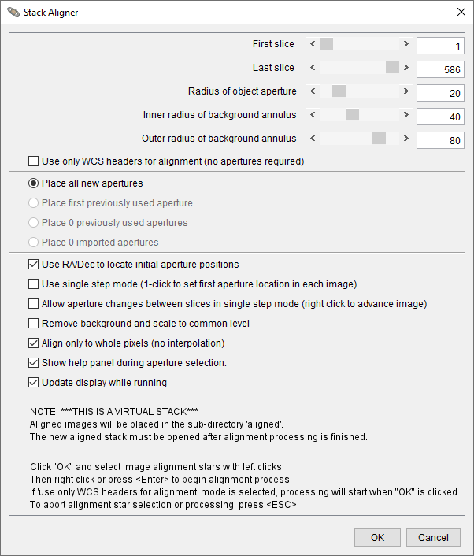">
  <figcaption><strong>Figure 5.</strong> Stack Aligner interface</figcaption>
</figure>

If all images in the stack have been plate solved, they can be aligned using information in the WCS headers. To use this mode, enable the `Use only WCS headers` option and click the `OK` button to start the alignment process. All images in the stack will then be aligned to the first image.

If images have not been plate solved, apertures may be used to identify alignment stars. Images are aligned based on the average centroid offsets of alignment stars between consecutive images. Aperture alignment works best when at least a few (approximately 3–5) isolated stars are available. Alignment will fail if the shift from one image to the next exceeds the aperture radius. However, the aperture radius can be made arbitrarily large as long as the centroid does not capture a neighboring star instead of the intended alignment star.

For cases with large image shifts, the `Use single step mode` option allows the user to click on the first alignment star in each image of the sequence, preventing the aperture from centroiding on the wrong star. This mode requires a click in every image of the sequence, which may become impractical for very long image sets.

An option is available in the `Process` menu above the image display that provides the `Align stack using image stabilizer` functionality, which is useful for processing images of non-stellar objects. This tool removes atmospheric jitter from rapid sequences of planetary or lucky images, or tracks a comet over a long duration as it moves across a star field.

---

### Menus above the Image Display
A set of pull-down menus is located at the top of the image display, providing easy access to many features commonly used in astronomical image analysis.

- `File` — Contains options for opening and saving images, stacks, and data files. For example, the `Save image display as PNG` option saves the currently displayed image as a PNG file, including all visible overlays and using the current contrast settings. Other save options allow saving the full-resolution image without annotations or apertures.  
- `Preferences` — Offers options for customizing how the image is displayed, including settings related to the live photometer and the values displayed above the image.
- `Contrast` — Provides tools to adjust image brightness and contrast manually or automatically.
- `View` — Allows you to change the image orientation and control the display of informational overlays. The `Clear Overlay` option removes drawn apertures and ROIs, but retains annotation overlays. These view options are non-destructive and do not alter the underlying image data.
- `Annotate` — Includes tools for displaying, modifying, or adding annotations from/to the FITS header.
- `Measure` — Provides options to measure distances in arcseconds or pixels, determine position angles, and save the results.
- `Edit` — Contains options for editing image-related settings such as aperture definitions, ImageJ measurement settings, FITS header entries, and stack configuration.
- `Process` — Offers tools for modifying the actual pixel data within an image (e.g., arithmetic operations or filters).
- `Color` — Includes options for working with RGB images, such as color channel adjustments or conversions.
- `Analyze` — Provides several options to measure the data within an image and to plot and/or save those results. These options do not modify the image data.
- `WCS` — Offers tools related to World Coordinate System (WCS) information, including plate solving and setting the pixel scale for images without existing WCS headers.

---

### Notes on Generic ImageJ Regions of Interest
Some tools in the `Analyze` menu require that a Region of Interest (ROI) be defined before the function can be used. The most commonly used ROI shapes are oval, rectangle, and line.

ROIs can be drawn by selecting the appropriate tool from the AIJ toolbar. However, while drawing an ROI this way, you will temporarily lose astro-mode features such as panning and mouse-based interaction. Once you are done drawing, click the astro-mode icon to restore full astro-mode functionality.

Keyboard shortcuts can be used to move or edit an existing ROI:
- Hold `Tab`, then click and drag the ROI to move it.
- To resize, hold `Tab` and hover over a selection point until the cursor changes to a hand, then click and drag to adjust the shape.

ROIs can be cleared by clicking the `clear apertures and annotations from overlay` icon  above the image display or by clicking the `Clear Overlay Icon` icon  on the AIJ toolbar.

# Data Processor Module

The `Data Processor` (DP) module prepares raw astronomical images for measurement. Before performing multi-aperture photometry, images are usually calibrated in DP to remove camera and optical effects that would otherwise distort measurements.

DP applies three main corrections in sequence:
- Bias subtraction removes the fixed electronic offset in every exposure.
- Dark subtraction removes thermal current accumulated during exposure.
- Flat-field division corrects for pixel-to-pixel sensitivity differences and uneven illumination.

It can also correct detector non-linearity, update FITS headers with time and coordinate information, and save results in a variety of formats. DP may run once on a completed dataset (post-processing mode) or continuously as new images are acquired (real-time mode).

In practice, DP converts raw frames into calibrated images whose pixel values represent the actual light collected from the sky, ready for accurate and precise photometric measurements.

## Overview of Operation

To start a data processing session, click the DP icon  on the AIJ toolbar, or in the `Image Display` window use the menu selection `Process` → `Data reduction facility`. The Data Processor (DP) functions like a script, running selected calibration and science images through a predefined sequence.

You can define directory paths and filename patterns for the data to be processed. Checkboxes allow you to enable or disable various processing tasks. Each field or option in the DP window includes a “tooltip” that appears when the mouse hovers over it for about a second. The tooltip disappears after 3–4 seconds, but if needed, you can slowly move the mouse over the item again to keep the text visible longer—useful for reading longer descriptions.

The DP module supports input and output in any format supported by generic ImageJ. Input and output formats can be the same or different (e.g., FITS files as input and TIFF files as output).

The `Data Processor` interface is shown in **Figure 6**.

<figure style="text-align:center">
  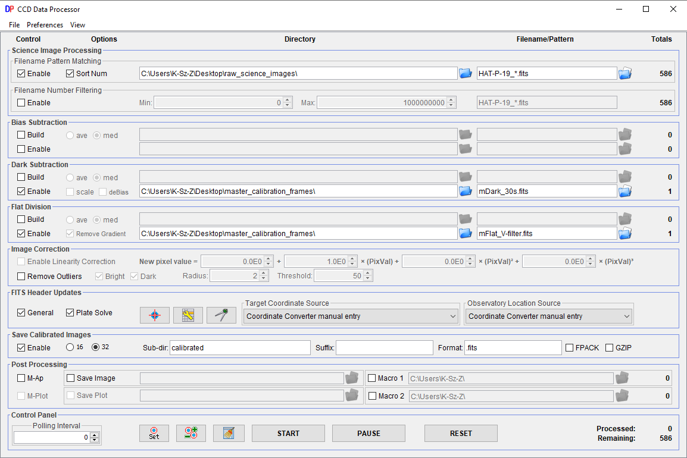">
  <figcaption><strong>Figure 6.</strong> Data Processor interface</figcaption>
</figure>

## Horizontal Sections
The `Data Processor` (DP) graphical interface is organized into five horizontal sections and nine vertical sections. Starting from the left, the horizontal sections are labeled at the top of the panel as follows:

### Control
The control checkboxes allow each processing step to be individually enabled or disabled. Typically, the steps are executed in sequence from the top to the bottom of the panel.

### Options
The options checkboxes provide additional configuration settings for each processing step.

### Directory
The directory boxes specify the folder location for each category of image files. The blue folder icon  next to each box can be used to browse and select a directory. Alternatively, the directory path can be typed manually, or it will be populated automatically when a filename pattern is selected (see below).

Raw and master calibration file directories can either follow the science image directory or operate independently, depending on the `Preferences` settings in the DP panel. If a directory box is left empty, it will default to the same directory as the science images.

Unix/Linux/DOS-style notation can be used for relative paths. For example:
- `./darks` refers to a subdirectory named `darks` inside the current science image directory.
- `../..` refers to the parent directory two levels above the current location.
- `../../cals` refers to a directory named `cals` located two levels up.

### Filename/Pattern
The filename pattern boxes define which files in the directory should be processed. Use Unix-style wildcard characters such as `*` and `?` to specify patterns. The blue and white folder icon  on the right side of each box can be used to select a sample file. When selected, the directory and filename pattern will update accordingly.

By default, AIJ automatically inserts a `*` wildcard between the last underscore and the final dot in the filename. This behavior can be turned off in the `Preferences` menu at the top of the DP panel.

### Totals
The totals column displays the number of files found in each directory that match the specified filename pattern. In addition, the `Control Panel` at the bottom of the DP panel summarizes how many files have already been processed and how many remain.

## Vertical Sections

## Science Image Processing
The `Science Image Processing` section of the `Data Processor` defines how your science images are selected and prepared for processing. It consists of two subsections: `Filename Pattern Matching` and `Filename Number Filtering`.

- `Filename Pattern Matching`: Configure the directory and filename pattern for your science images and ensure it is enabled. If this subsection is disabled, science images will not be processed. You can also enable the `Sort Num` option to process matching files in numerical order. The numeric value of each file is determined by concatenating all numeric digits found within its filename. The value shown in the `Totals` column indicates how many files match the defined pattern. If this subsection is disabled, the `Totals` value will be zero.

- `Filename Number Filtering`: Provides finer control over which images are processed. It allows you to exclude files that match the filename pattern but fall outside a defined numeric range. To use this feature, specify minimum (`Min`) and maximum (`Max`) numeric values. The filtering relies on a filename pattern that indicates which characters should be used to extract numeric values:
  - Numeric characters aligned with wildcard positions (`*` or `?`) are included.
  - If the full pattern matches part of the filename, any subsequent numeric digits are also included.

Example: for the file `mars01a34out.fits` with the pattern `mars`, the extracted numeric value is `134` (combining “01” and “34”). The pattern in this subsection is initially copied from the pattern matching subsection but can be modified independently afterward.

This section ensures that only the intended science image files are processed while allowing flexibility to control ordering and filtering.


## Bias Subtraction
The `Bias Subtraction` section defines how bias frames are used during image calibration. It includes controls for specifying both raw bias frames and master bias frames.

- **Using an existing master bias:** If a master bias file has already been created, deselect `Build`, select `Enable`, and specify the location and filename of the master bias file using the lower directory and filename fields.

- **Creating a new master bias:** To generate a master bias file from raw bias frames, select `Build`, then choose either `ave` (average) or `med` (median) to combine the frames. Define the directory and filename pattern for the raw bias frames in the upper line. The resulting master bias file will be saved at the location specified in the lower line.

During science image calibration, this master bias will be applied to subtract the bias signal. The `Totals` column on the upper line shows how many raw bias frames match the specified pattern, while the lower line shows how many files match the master bias filename (typically one or zero).

## Dark Subtraction
The `Dark Subtraction` section allows you to define raw and master dark frame locations and filenames.

- **Using an existing master dark:** If a master dark file is already available, deselect `Build`, select `Enable`, and specify the location and filename of the master dark file using the lower directory and filename fields.

- **Creating a new master dark:** To create a master dark from raw dark frames, select `Build`, then choose either `ave` (average) or `med` (median) to combine them. Specify the directory and filename pattern for the raw dark frames in the upper line. The resulting master dark file will be saved in the location defined in the lower line.

If the `scale` option is enabled, AIJ will scale the pixel values in the master dark based on the ratio:

```
science (or raw flat) exposure time / master dark exposure time
```

For this scaling to work, `Enable` must be checked for both the master bias and the master dark, and both the science and dark frames must include valid exposure times in their FITS headers.

**Important Notes:**
- If bias subtraction is not enabled, created master dark frames will include the bias signal.
- If bias subtraction is enabled, master darks will be bias-subtracted using the defined master bias.
- If `Enable Linearity Correction` in the `Image Correction` section is enabled along with `Bias Subtraction`, the bias-subtracted dark will also be scaled using the coefficients defined in the `Image Correction` section.

## Flat Division
The `Flat Division` section is used to define the locations and filenames for raw and master flat-field images.

- **Using an existing master flat:**
  If a master flat file has already been created, deselect `Build`, select `Enable`, and specify the directory and filename of the master flat using the lower fields.

- **Creating a new master flat:**
  To create a master flat from raw flat images, select `Build`, then choose either `ave` (average) or `med` (median) combining. Specify the location and filename pattern for the raw flats in the upper line. The resulting master flat will be saved at the location specified on the lower line.

When processing science images, the same master flat will be applied to flat-field all files. The `Totals` column on the upper line indicates the number of raw flat files that match the defined pattern, while the lower line shows how many files match the master flat filename (typically one or zero).

The section includes an option to `Remove Gradient from Calibrated Raw Flats` when building a master flat. This option is useful if your flat-field source (e.g., twilight sky, dome flat) is unevenly illuminated. It fits a plane to each calibrated flat frame and removes the illumination gradient before combining the images.

**Important Note:**
When building a master flat, if the raw flats are taken with exposure times different from the master dark, a master bias must be defined and enabled. This allows a bias-subtracted master dark to be scaled to match each flat’s exposure time. DP does not support using multiple master darks for flats of different exposure times.

## Linearity Correction & Outlier Removal
The `Image Correction` sub-panel provides two independent functions: `Enable Linearity Correction` and `Remove Outliers`.

The `Enable Linearity Correction` option applies a CCD nonlinearity correction to compensate for the detector’s deviation from an ideal linear response. Each pixel’s ADU value in the bias-subtracted dark, flat, and science images is replaced with a corrected value calculated using the polynomial relation

```
ADU_corrected = c0 + c1 * ADU + c2 * ADU^2 + c3 * ADU^3
```

where the coefficients \(c_n\) describe the non-linear behavior of the detector.
To use this feature, `Enable Linearity Correction` must be selected, **bias subtraction must be enabled**, and a **master bias image** must be specified. The correction is applied to all relevant frames—science, dark, and flat—immediately after bias subtraction.

The `Remove Outliers` option applies a thresholded median filter to identify and replace pixel outliers such as cosmic ray hits and hot or cold pixels. It improves the cosmetic appearance of science images but should **not** be used when preparing images for photometric extraction, as altering pixel values can distort measured fluxes.

**Important Note:**
If non-linearity correction is applied to science images, the master calibration files must either:
- be built during the same session with non-linearity correction enabled, or
- have been previously created using the same correction coefficients and master calibration files.

## FITS Header Updates
The `FITS Header Updates` section does two things:
1. **Updates FITS headers with calculated astronomy metadata** such as `BJD_TDB`, `AIRMASS`, `AZ_OBJ`, and other keywords.
2. **Configures plate solving and writes WCS information** to FITS headers.

The user can enable these with the checkboxes in the sub-panel:
- `General` — enables calculation of new metadata and writing the results to the calibrated image headers.
- `Plate Solve` — enables plate solving and WCS header updates for images.

The three small buttons to the right open the related setup panels:
- **Rightmost icon:**  `Astrometry Settings` — astrometry.net plate-solve configuration. See the **Plate Solving using Astrometry.net** subsection.
- **Middle icon:**  `General FITS Header Settings` — opens the panel for selecting input and output keyword names.
- **Leftmost icon:**  `Coordinate Converter` — opens the `Coordinate Converter` (CC) used for time/coordinate calculations. This panel is discussed in the **Coordinate Converter** section (that comes after this section on DP).

---

### Plate Solving using Astrometry.net
AIJ can perform astrometric plate solving using an internet connection to the Astrometry.net web portal at [nova.astrometry.net](https://nova.astrometry.net). After a successful solution, WCS (World Coordinate System) headers are added to the FITS image header, and the file can optionally be resaved with these headers.

Unlike typical uploads to Astrometry.net, AIJ only sends the x,y coordinates of detected stars (up to the number specified in `Max Num Stars`) rather than the full image, which speeds up solving and reduces network load.

To open the `Astrometry Settings` panel:
- Enable `Plate Solve` in the `FITS Header Updates` section of the `Data Processor` (DP) panel and click the icon . **Figure 7** shows the `DP Astrometry Settings` panel.
- Alternatively, click the `Plate Solve` icon  above an image or image stack.

The first time you use this feature, obtain a free user key from [nova.astrometry.net](https://nova.astrometry.net) and enter it in the `User Key` field.

<figure style="text-align:center">
  ">
  <figcaption><strong>Figure 7.</strong> Astrometry Settings interface (its DP version)</figcaption>
</figure>

#### Astrometry Settings Options (in window order):
1. `User Key`: Enter your obtained API key.
2. `Use Custom Server`: Enable to use a different Astrometry.net server URL (e.g., a local installation).
3. `Re-save Raw Science`: Overwrites the original science FITS file with WCS-added data. Can optionally compress with:
   - `FPACK`: FITS tile compression.
   - `GZIP`: Standard gzip compression.
4. `Skip Images With WCS`: Skip solving for images that already contain WCS headers.
5. `Annotate`: Overlay object labels onto the image after solving.
   - `Radius (pixels)`: The radius of the circle used to identify the annotated object.
6. `Add To Header`: Add annotations to the FITS header.
7. If the `Astrometry Settings` panel is opened via the `Image Display` panel (rather than via the DP panel), an additional `Process Stack` option will be available, which if enabled, allows to plate solve not only the currently selected slice, but also other images in the currently opened image stack:
   - `Start Slice`: The first slice number to process.
   - `End Slice`: The last slice number to process.
8. `Median Filter`: Enable a smoothing filter to reduce noise before source detection.
   - `Filter Radius (pixels):` Set the radius of the median filter used before finding peaks.
9. `Peak Find Options` / `Limit Max Peaks`: Enable to ignore sources brighter than a given peak ADU.
   - `Max Peak (ADU)`: Maximum acceptable peak value.
   - `Noise Tol (StdDev)`: Noise threshold for peak detection.
   - `Max Num Stars`: Number of detected stars to send to Astrometry.net.
10. `Centroid Near Peaks`: Refine detected star positions using centroiding (recommended for defocused images).
   - `Radius (pixels)`: Aperture radius used for centroid refinement.
   - `Sky Inner (pixels)`: Inner radius of the sky annulus for centroiding.
   - `Sky Outer (pixels)`: Outer radius of the sky annulus.
11. `Constrain Plate Scale`: Enable if the expected plate scale is known. Enter:
    - `Plate Scale (arcsec/pix)`: Nominal pixel scale (e.g., 0.50 arcsec/pix).
    - `Tolerance (arcsec/pix)`: Allowable deviation from the nominal scale (e.g., 0.01 arcsec/pix).
12. `Constrain Sky Location`: Enable to restrict the solve to a known sky region. Enter:
    - `Center RA (Hours)`: Central right ascension coordinate.
    - `Center Dec (Degrees)`: Central declination coordinate.
    - `Radius (arcmin)`: Search radius around the center.
13. `SIP Distortion Correction`: Enable to solve for SIP distortion terms.
    - `SIP Order`: Polynomial order for SIP distortion correction (default: 2).

Once configured, click `SAVE AND EXIT` to save your settings or `SAVE` to save without exiting. For image stacks, click `START` in the DP panel to plate solve all frames automatically.

**Warning:** Enabling `Re-save Raw Science` will overwrite your original FITS files. Use compression and backups appropriately.

---

### General FITS Header Settings
DP provides the option to calculate new astronomical data and add it to the FITS header of a calibrated image. The option is enabled by selecting the `General` check box in the `FITS Header Updates` sub-panel of DP. A setup panel is accessed by clicking the `General FITS Header Settings` icon . The `General FITS Header Settings` panel opens (see **Figure 8**).

<figure style="text-align:center">
  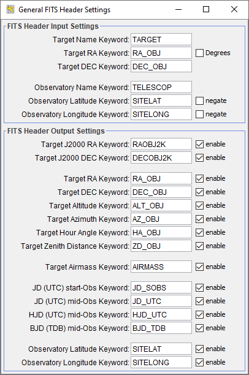">
  <figcaption><strong>Figure 8.</strong> General FITS Header Settings panel</figcaption>
</figure>

- `FITS Header Input Settings` defines keyword names already present in the raw science-image headers that may be used in the calculation of new values.
- `FITS Header Output Settings` specifies which new values to compute (e.g., altitude, airmass, `JD_UTC`, `HJD_UTC`, `BJD_TDB`) and the keyword names to use when writing them to the calibrated images.

The astronomical calculations require target sky coordinates and observatory geographic coordinates to be supplied to the `Coordinate Converter` (CC). Both sets of coordinates can be manually entered into CC by setting `Target Coordinate Source` to `Coordinate Converter manual entry` and `Observatory Location Source` to `Coordinate Converter manual entry`. Alternatively, coordinates can be supplied automatically from the FITS header of the raw image by setting the corresponding keyword names in `FITS Header Input Settings` and then selecting the appropriate `Target Coordinate Source` and `Observatory Location Source` to match the type of data in the header (target/observatory name or numeric coordinates). See below for further details.

#### Target Coordinate Source
The target’s coordinates can be defined in five ways using the `Target Coordinate Source` dropdown:
1. `Coordinate Converter manual entry`: manual SIMBAD name or coordinates in CC. After editing a field, press `Enter`.
2. `FITS header target name`: uses the keyword defined in the `General FITS Header Settings` panel (e.g., `Target Name Keyword`). Its value is passed to CC’s SIMBAD field to query SIMBAD (internet required). Duplicate names in a run are cached to avoid repeated queries.
3. `FITS header target name (less trailing alpha)`: same as above but strips a trailing alpha (e.g., `WASP-12b` → `WASP-12`) before querying, useful when the planet entry lacks proper motion but the host star entry includes it.
4. `FITS header RA/DEC (J2000)`: uses the keywords defined for `Target RA Keyword` and `Target DEC Keyword` in the `FITS Header Input Settings`. Values may be decimal or sexagesimal.
5. `FITS header RA/DEC (epoch of observation)`: like J2000 but coordinates must correspond to the observation epoch.

#### Observatory Location Source
The observatory location can be defined using the `Observatory Location Source` dropdown:
1. `Coordinate Converter manual entry`: choose from CC’s observatory list or select `Custom Lon, Lat, and Alt entry` and enter values directly.
2. `FITS header observatory name`: uses the keyword defined in `Observatory Name Keyword`. DP matches the value to CC’s list (case-insensitive; underscores treated as spaces). No match triggers an error.
3. `FITS header latitude/longitude`: uses keywords set in `Observatory Latitude Keyword` and `Observatory Longitude Keyword`. Values may be numeric or sexagesimal. If latitude is south-positive or longitude is west-positive in the header, enable the corresponding `negate` checkboxes in `General FITS Header Settings`.

#### Exposure Start Date & Exposure Time Source
The **UTC start of exposure date and time** must be defined in the science image’s FITS header using one of the following keywords: `DATE-OBS`, `DATEOBS`, `DATE_OBS`, or `UT_DATE`.
If both date and time are not found in a single keyword, DP searches separately:
- For the date: `DATE-OBS`, `DATEOBS`, `DATE_OBS`, `UT_DATE`.
- For the time: `TIME-OBS`, `TIMEOBS`, `TIME_OBS`, `TM-START`, `TM_START`, `UT`, `UTC`, `UTSTART`, `UT-START`, `UT_START`, `UT_TIME`.

These keywords are fixed and not configurable in the `General FITS Header Settings` panel .

**Exposure time** is required to calculate mid-exposure-based time standards. DP searches for exposure time in the following order:
- Primary keywords: `EXPTIME`, `EXPOSURE`.
- If not found, keyword pairs for exposure start and end times: `TM-START + TM-END`, `TM_START + TM_END`, `UT-START + UT-END`, `UT_START + UT_END`.

## Save Calibrated Images
This section controls how calibrated output images are saved. If the `Enable` option is not selected, no calibrated images will be written to disk; however, any tasks in the `Post Processing` section will still be applied to the calibrated images in AIJ memory.

Calibrated images can be saved in either:
- **16-bit integer format**, or
- **32-bit floating-point format** (if supported by the chosen output format; recommended for FITS images).

Images can be stored in:
- A subdirectory of the directory defined in the `Science Image Processing` section by entering its name in the `Sub-dir` field, or
- The same directory as the input files by leaving the field blank.

The `Suffix` field defines a string appended to the calibrated file name, inserted before the file extension. For example, with `Suffix` set to `_out`, an input file `image.fits` becomes `image_out.fits`. Leaving this field blank keeps the original file name.

The `Format` field allows you to specify the desired output format. Leaving it blank preserves the original format. Supported formats include:
- **FITS:** `.fits`, `.fit`, `.fts`,
- **Images:** `.tif`, `.jpg`, `.gif`, `.png`, `.bmp`, `.raw`,
- **Others:** `.avi`, `.zip`.

Select `FPACK` to compress output files using FITS tile-compression (with headers remaining uncompressed), or `GZIP` to compress files in `.gz` format. Both formats can be opened directly in AIJ without manual decompression. Master calibration files can also be saved in either format by selecting `FPACK` during saving or by appending `.gz` for GZIP compression (e.g., `mdark.fits` with FPACK or `mdark.fits.gz` with GZIP).

## Post Processing
This section provides options to run additional tasks after each image has been calibrated:
- `Multi-Aperture`: Enables automatic photometric measurements after calibration. The `Multi-Aperture` setup panel will appear only after the first calibration, or if manually opened by clicking the icon  before or during a DP run.
- `Multi-Plot`: Automatically plots photometric results from `Multi-Aperture` if enabled.
- **ImageJ Macros:** Two ImageJ macros can be executed sequentially after each processed image. You can enter the full path manually or use the folder button  to navigate to the macro file. The `Totals` column displays `0` if the file is not found or `1` if it is found.

The processing order is as follows: **Macro 1** → **Macro 2** → `Multi-Aperture` → `Multi-Plot`.

The ImageJ macro language is beyond the scope of this user guide; however, comprehensive documentation and examples are available [here](https://imagej.net/ij/docs/).

## Control Panel
The `Control Panel` provides options to start, pause, stop, and reset DP runs, as well as access related controls and features.

- Click the `START` button to begin processing all files. While files are being processed, this button displays `RUNNING`. Pressing `PAUSE` while in the `RUNNING` state changes the `START` button label to `CONTINUE`. Pressing `CONTINUE` resumes processing from the point at which it was paused.

- Click the `PAUSE` button to temporarily halt file processing while in the `RUNNING` state. Press `CONTINUE` to resume processing from the pause point, or click `RESET` followed by `START` to restart processing from the beginning.

- The `RESET` button clears the current processing queue so that all defined processing steps are reapplied. If DP is in the `RUNNING` state, press `PAUSE` before pressing `RESET`. After resetting, press `START` to reprocess all files.
  - If `Process only new science files written after pressing 'START' button` is **deselected** in the `Preferences` menu (default), all matching files will be reprocessed.
  - If `Process only new science files written after pressing 'START' button` is **selected** in the `Preferences` menu, only new files written to the science directory since the last run will be processed.

**Post-processing mode:** set the `Polling Interval` to zero (`0`). In this mode, DP processes all images that match the filters at the time `START` is pressed, then stops automatically.

**Real-time mode:** set the `Polling Interval` to a non-zero value (e.g., 5 seconds is a good starting point). DP will:
1. Process all matching files currently in the directory.
2. Wait for the polling interval.
3. Rescan the directory for new matching images and process them automatically.

This cycle continues until `PAUSE` is pressed. In real-time mode, each image will be calibrated, and optionally, the `Multi-Aperture` and `Multi-Plot` modules can be triggered to perform photometry and plot light curves in real time as new images are acquired. The `Totals` fields display how many files have been processed and how many remain. Note that the `Remaining` count is updated after each polling cycle and does not reflect newly added files until the current cycle completes.

Additional DP controls include quick access to other options:
- The `Set Aperture` button 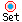 opens the aperture settings panel.
- If DP is paused and then resumed (or paused, reset, and restarted), the same `Multi-Aperture` settings and aperture locations will be reused unless the settings icon  is pressed.
- To clear the measurements table when restarting a DP run, press the `Clear Measurements Table` button  or close the measurements table window manually.

# Coordinate Converter
The `Coordinate Converter` (CC) module converts coordinates and times among multiple systems, using the observatory location and target coordinates.

The `Coordinate Converter` has two modes of operation:
- **DP-controlled:** when CC is used while calibrating images via the `Data Processor` module, becoming **DPCC** (or via `Multi-Plot`, described later in the manual), some of the fields are disabled. For example, the epoch of interest cannot be modified; in this mode, time is read from the corresponding FITS header.
- **User-controlled:** launched from the AIJ toolbar. All fields are editable. Since AIJ uses DPCC when calibrating images, this mode is generally used less often.
  
The CC user interface is shown in **Figure 9** (DPCC in this case). The top row shows the current date and time in UTC, local time, Julian Date, and local sidereal time (LST) formats. These and other items with a gray background cannot be modified by the user. Tooltips are provided for each item to describe its use and syntax. Tooltips can be disabled under the `Preferences` menu.

<figure style="text-align:center">
  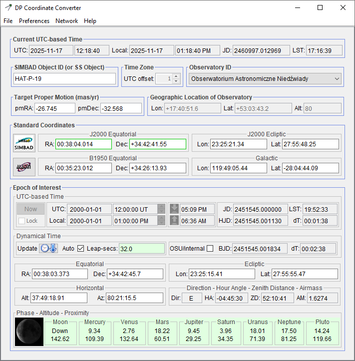">
  <figcaption><strong>Figure 9.</strong> Coordinate Converter window (DPCC in this case)</figcaption>
</figure>

---

### Target & Observatory Coordinates

#### SIMBAD / Solar-system targets
- In `SIMBAD Object ID (or SS object)`, enter a valid SIMBAD object name and press `Enter`.
  If the object is found, the following update automatically:
  - `Target Proper Motion (mas/yr)`: `pmRA`, `pmDec`
  - `Standard Coordinates` → `J2000 Equatorial`: `RA`, `Dec`
  These updated coordinate fields receive a **green border**, indicating they are the active source from which all other coordinates are computed.
- You may also enter the names of major solar-system (`SS`) objects (`Moon`, `Mercury`, `Venus`, `Mars`, `Jupiter`, `Saturn`, `Uranus`, `Neptune`, `Pluto`) in `SIMBAD Object ID (or SS object)`, or click the associated `proximity box` at the bottom of the interface to insert the object name automatically. When a solar-system body is selected, the `RA` and `Dec` in `Epoch of Interest` → `Equatorial` update automatically, since these bodies do not have relatively fixed right ascensions and declinations.
- To exit solar-system-object mode, clear the name from `SIMBAD Object ID (or SS object)` and press `Enter` in either the `RA` or `Dec` field in `Standard Coordinates` → `J2000 Equatorial`.

#### Direct coordinate entry
- Instead of using a SIMBAD name, you may type or paste coordinates directly into any coordinate pair, such as `RA` & `Dec` in `Standard Coordinates` → `J2000 Equatorial`, then press `Enter`. Entering coordinates directly:
  - Clears the `SIMBAD Object ID (or SS object)` text.
  - Clears any proper motion values **unless** the SIMBAD field is already empty.
- Any coordinate pair (except those for major solar-system bodies) can serve as the **source** for computing all other coordinates. The active pair is indicated by a **green border**.
- For convenience, both coordinates of a pair may be typed or pasted into **one** box of the pair. When you press `Enter`, the program separates the values and places them into the appropriate boxes.

For syntax details, see `Numbers, Bases, Formats, and Indicators` subsection.

#### Observatory coordinates / time zone
- Select the desired `Observatory ID` from the program’s built-in list of observatories. The observatory `Lon`, `Lat`, and `Alt` (longitude, latitude, altitude) update automatically. If additional observatories are needed, enable `Use custom observatory list` in the `Preferences` menu. Then select `Edit Custom Observatory List` from the same menu, which opens the `observatories.txt` file. Add the observatory name and coordinates on a new line, and save changes when finished.
- To enter custom observatory coordinates, choose `Custom Lon, Lat, Alt entry` (first item in the `Observatory ID` list) and manually enter `Lon`, `Lat`, and `Alt`. If any other `Observatory ID` is selected, these three fields are disabled.
- To use a time zone different from the computer’s current setting:
  1. In the `Preferences` menu, deselect `Use computer time zone, deselect to manually enter offset from UTC`.
  2. Enter the desired UTC offset (in hours) in the `UTC offset` field.

#### SIMBAD / Aladin buttons
- The `SIMBAD` button in `Standard Coordinates` opens SIMBAD in your default browser:
  - If `SIMBAD Object ID (or SS object)` contains text, a SIMBAD object query is issued using that text.
  - If that field is empty, a SIMBAD coordinate query is issued using the `RA` and `Dec` in `Standard Coordinates` → `J2000 Equatorial`.
- The `Aladin` button in `Standard Coordinates` opens a sky map in your default browser, centered on the `RA` and `Dec` in `Standard Coordinates` → `J2000 Equatorial`.
Settings related to these buttons, such as search radius for SIMBAD quries, can be accessed in `Preferences` menu under `Edit Aladin F.O.V. Settings` and `Edit SIMBAD Settings`.

---

### Epoch of Interest

#### UTC-based Time
The `UTC-based time` subsection must be entered, unless CC was launched from the DP panel, in which case these fields are not editable. Click `Now` to set the epoch of interest to your computer’s current time. Select `Lock` to keep it synced to your computer every second. Otherwise, the epoch can be entered as UT date/time, local date/time, Julian Day (JD), Heliocentric JD (HJD), or Barycentric JD (BJD). All other formats are calculated from the one you enter.

Use the mouse scroll wheel over any `UTC` or `Local` date/time component (year, month, day, hour, minute, second) to increment or decrement it. The up/down arrows beside `UTC` and `Local` time do the same. Right-click the arrows or the `JD` field to set the increment step. The scroll wheel also adjusts time when the pointer is in the `JD` field.

Evening and morning nautical twilight start/end times are displayed for the epoch of interest. Click these fields or their icons to set the current time to the selected twilight. If the epoch lies between evening and morning twilight, the twilight fields turn green.

#### Dynamical Time & BJD calculation
Leap second data in the `Dynamical Time` subsection must be kept current for accurate dynamical time and coordinate calculations. Press `Update` while connected to the internet to download the latest data, which is then saved with other program preferences. Leap second data comes from the U.S. Naval Observatory (http://maia.usno.navy.mil/ser7/tai-utc.dat). New leap seconds may be introduced on June 30 or December 31, with announcements made months in advance. Press `Update` every 3–6 months to check for changes.

If `Auto` is selected, CC chooses the correct leap second value for the epoch of interest (this does not update the table). A green `Leap-secs` background means the value comes from the table, which is valid from 1/1/1961 through the present. Outside this range, leap seconds must be estimated. CC uses the Espenak and Meeus (2006) formulae for epochs from 1999 BCE to 3000 CE; if the epoch is within this range, the `Leap-secs` background is yellow, otherwise red (no calculated value). If `Auto` is off, the field background is white and the user may enter a custom value.

AIJ can compute BJD (TDB) internally or via the Ohio State BJD Server. The `OSU/internal` checkbox switches between:
- **Deselected** – internal BJD calculation (recommended; ~250 ms precision, fast, no internet required)
- **Selected** – OSU server BJD calculation (~20 ms precision, slower, requires internet)

The same setting is also available in `Preferences` menu under `Use Ohio State BJD Server, deselect to calculate internally`.

#### Phase-Altitude-Proximity
The `Phase-Altitude-Proximity` subsection in the `Epoch of Interest` section shows the illuminated portion of the moon at the epoch of interest and the altitude of each solar system object (top number) and the distance from the current object coordinates (bottom number). A green background indicates that observations of the target of interest at the epoch of interest should be minimally affected by the solar system object. Yellow means the objects are near each other, and red means the objects are very near each other. A mouse click on the data field of a particular solar system body will make that object the current object of interest and its full coordinate conversions will be shown in CC.

---

### Numbers, Bases, Formats, and Indicators
Fields with gray, green, yellow, or red backgrounds cannot be modified. Fields with white backgrounds can. The coordinate pair outlined in green is the active pair; all other coordinates are computed from it. Coordinate conversions are not exact, so pressing `Enter` in a new coordinate pair (even with unchanged values) may slightly alter the other computed pairs.

RA, UT, and local time must be entered in hours; all other coordinates in degrees. Observatory latitude uses degrees (north positive) and longitude uses degrees (east positive). Proper motion is in SIMBAD milli-arcsec per year (mas/yr). UT and local date use the YYYY MM DD.DD format. Hour Angle (HA) spans −12:00:00 to 00:00:00 (sidereal hours until meridian crossing) and 00:00:00 to 12:00:00 (hours since crossing).

All numbers except UT and local date may be entered in decimal (dd.d) or sexagesimal (dd.d mm.m ss.s) format. The parsing is flexible: any group of characters that are not numbers is treated as a separator. If a field contains more than one set of separated numbers, sexagesimal format is assumed. Both coordinates of a pair may be typed or pasted into one box; after pressing `Enter`, the first set of three numbers is placed in the left box and the second set in the right. If a plus or minus sign appears before any number other than the first, that component marks the start of the second coordinate.

---

### Network
Several internet-related settings are provided under the `Network` pull-down menu at the top of the user window.

- `Use Harvard SIMBAD Server, deselect to use CDS Server`
   - **Deselected** – use the SIMBAD server at the Centre de données astronomiques de Strasbourg (CDS), France
   - **Selected** – use the SIMBAD server at Harvard

- `Use Ohio State BJD Server, deselect to calculate internally`
   - **Deselected** – calculate BJD internally (recommended; slightly less accurate `250 ms` precision, but fast and requires no internet connectivity)
   - **Selected** – use the Ohio State server to calculate BJD (more accurate `20 ms` precision, but slower and requires internet connectivity)

- `Use proxy server for internet access`: This setting controls how CC accesses SIMBAD when resolving a target name to coordinates, and when it accesses the Ohio State server to calculate BJD when `Use Ohio State BJD Server, deselect to calculate internally` is enabled. This setting does **not** control how the default browser accesses the internet when the SIMBAD and Aladin buttons are clicked in the `Standard Coordinates` panel. If a proxy server is required for the default browser to access those websites, the settings within the browser must be changed to define and use a proxy server.
   - **Deselected** – send SIMBAD and Ohio State website queries directly
   - **Selected** – use the proxy server defined in the next two settings to send SIMBAD and Ohio State website queries

- `Set proxy server address`: Clicking this option opens a dialog that allows the user to enter a proxy server address.

- `Set proxy server port number`: Clicking this option opens a dialog that allows the user to enter a proxy server port number. The port number normally used is `8080`. If a port number outside the range `0–65535` is entered, or if any non-numeric characters are entered, the previous port number will be retained.