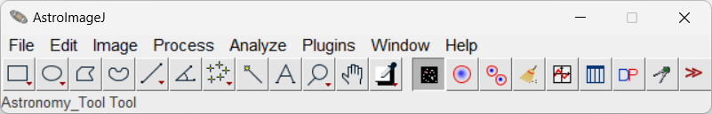
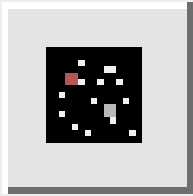
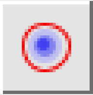
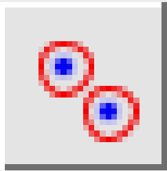
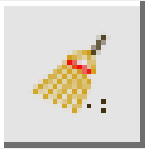
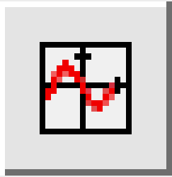
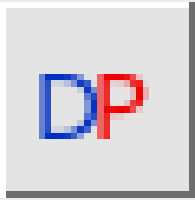
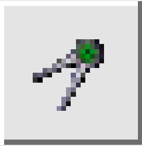
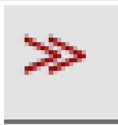

:::tip[Under Construction]
:::

# Introduction

## How to Think About AstroImageJ

AstroImageJ (AIJ) is software designed for extracting photometry from astronomical images, as well as everything in between: from image calibration to exporting a light curve. It eliminates the need for any other software to perform these tasks. AIJ was created primarily for precise work with ground-based photometric observations of exoplanet transits. For exoplanet transit work, AIJ not only produces precise light curves but also allows fitting transit models to them. However, AIJ does not, for example, return uncertainties of the fitted transit parameters.

This illustrates how the software should be viewed—it is meant for obtaining highly precise light curves, performing detailed inspection of the data, and exporting the results to other tools used, for instance, to jointly determine planetary and orbital parameters from both ground- and space-based photometry.

AIJ can, of course, also be used for variable stars (such as eclipsing binaries) and objects like asteroids. For example, it allows exporting measurements in a format accepted by the American Association of Variable Star Observers (AAVSO) database. AIJ is the standard tool in the [TESS Follow-up Observing Program Subgroup 1](https://tess.mit.edu/followup/).

## Installation & Updates
Up-to-date installation files for Linux, macOS, and Windows are available on [the main page of the official AstroImageJ website](https://astroimagej.com/).

By default, AIJ notifies you at startup when a new version is available. To update manually or switch to an older build, open AIJ and navigate to AIJ Toolbar → `Help` → `Update AstroImageJ`. Choose a build from the pull-down menu (the daily build is selected by default), click `OK`, then AIJ downloads and installs it automatically. AIJ closes when the install finishes, and the next launch uses the version you selected.

# AstroImageJ User Interface

## AstroImageJ Toolbar
When AIJ is launched, the AIJ Toolbar appears, as shown in Figure 1. On the right side of the toolbar, you will find eight AIJ-specific icons, starting with the icon shown in the pressed (depressed) state below. Above the icons are the menus: `File`, `Edit`, `Image`, `Process`, `Analyze`, `Plugins`, `Window`, and `Help`. However, for typical AIJ use, only the `File` menu is generally useful, as it provides options for opening images. Image opening in AIJ is discussed in the “Image Display Window” section.

<figure style="text-align:center">
  ">
  <figcaption><strong>Figure 1.</strong> AstroImageJ Toolbar</figcaption>
</figure>

The toolbar functions similarly to that of generic ImageJ (IJ), but for most AIJ operations, you will want the " width="20" align="absmiddle"> icon selected, as shown. The corresponding mode is referred to as `Astro-Mode` throughout this guide. AIJ starts in this mode by default.

A brief overview of each toolbar icon is provided below.

" width="20" align="absmiddle"> **Astro-Mode Icon** — this button should typically stay selected (pressed) during normal AIJ use. If it is deselected, the mouse, keyboard, and image display revert to standard ImageJ behavior. The button can deselect automatically if you use a base ImageJ toolbar icon to draw a Region of Interest (ROI), such as a square or circle. ROIs are not usually required for AIJ tasks, but they can be useful for custom measurements. After drawing an ROI, be sure to reselect the astro-mode icon to return to astro-mode. Clicking other AIJ-specific toolbar icons does not change the astro-mode state.

" width="20" align="absmiddle"> **Single Aperture Photometry Icon** — when selected, this tool enables single-aperture photometry by simply left-clicking on the desired location within an image. If the centroid feature is enabled, the aperture will automatically snap to the nearest centroid. The resulting photometry data is output to a measurements table, which can then be plotted or saved to disk. Single-aperture photometry can also be performed—even if this icon is not active—by holding the `Shift` key while left-clicking on the image.

" width="20" align="absmiddle"> **Multi-Aperture Photometry Icon** — opens the `Multi-Aperture` photometry module, which is used to perform differential photometry on a series of images—typically ones that have already been calibrated. The `Multi-Aperture` tool generates a table containing photometry results. This tool is also accessible from the toolbar above image display in the `Image Display` window.

" width="20" align="absmiddle"> **Clear Overlay Icon** — removes all annotations and apertures from the image overlay.

" width="20" align="absmiddle"> **Multi-Plot Icon** — opens the `Multi-Plot` module, which allows you to plot multiple curves on a single graph using data from the table generated by `Multi-Aperture` or any other compatible table loaded from disk.

" width="20" align="absmiddle"> **Measurement Table Icon** — opens a previously saved measurements table, or any generic file that is tab-, comma-, space-, or whitespace-delimited, from disk. Alternatively, a data file can be opened by dragging and dropping it onto either of the two `Multi-Plot` control panels.

" width="20" align="absmiddle"> **Data Processor Icon** — opens the `Data Processor` (DP) module, which can:
- perform image calibration, including bias, dark, flat, and linearity correction;
- update FITS headers with additional data;
- perform plate-solving to add WCS data to FITS headers (requires internet access and a free user key from [nova.astrometry.net](https://nova.astrometry.net));
- run the `Multi-Aperture` and `Multi-Plot` tools after each image is calibrated;
- operate in real-time mode during observations.

" width="20" align="absmiddle"> **Coordinate Converter Icon** — opens the Astronomical Coordinate and Time Converter module, which converts time for specified sky coordinates and an observing location to and from various time systems, including UTC, local time, Local Sidereal Time (LST), Julian Date (JD), Heliocentric JD (HJD), and Barycentric JD (BJD TBD). The module also provides information on the lunar phase, as well as the angular proximity of the Moon and all major planets in the solar system.

" width="20" align="absmiddle"> **More Tools Icon** — this option allows the user to modify the toolset available on the AIJ Toolbar.