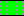
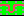

:::tip[Under Construction]
:::

# Inline icon rendering test

This sentence includes an inline icon:  
Here is an  icon,  
and here is another  icon right next to it.

Below are the same icons displayed separately for comparison:

