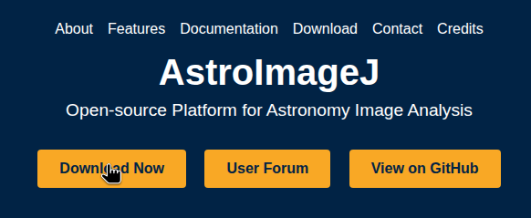
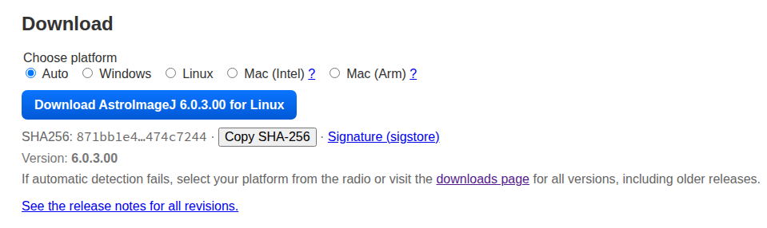
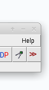
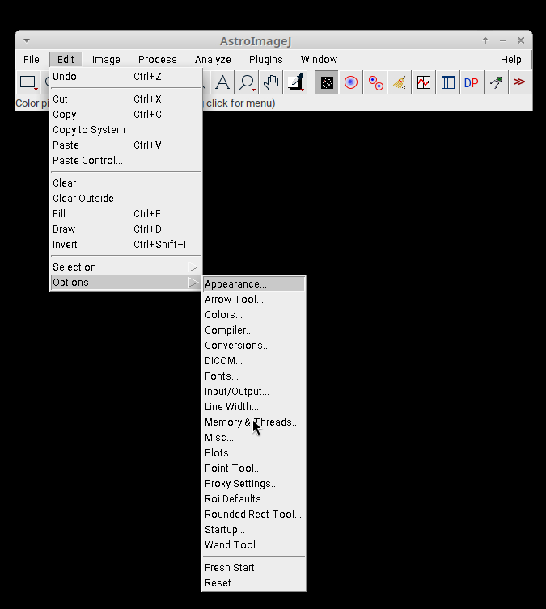
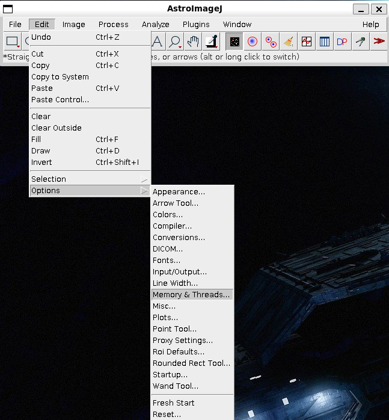
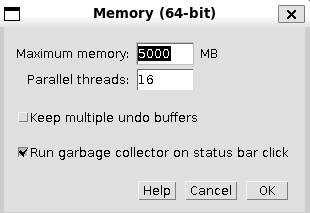
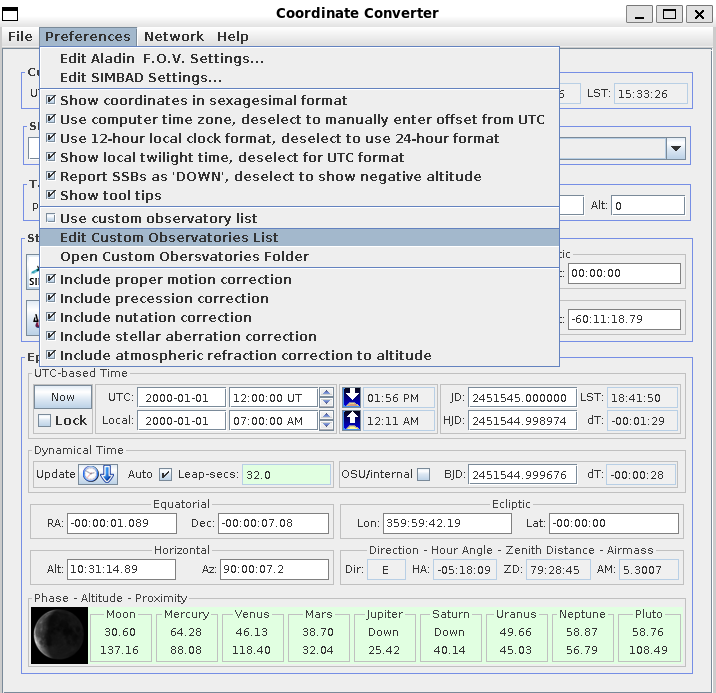
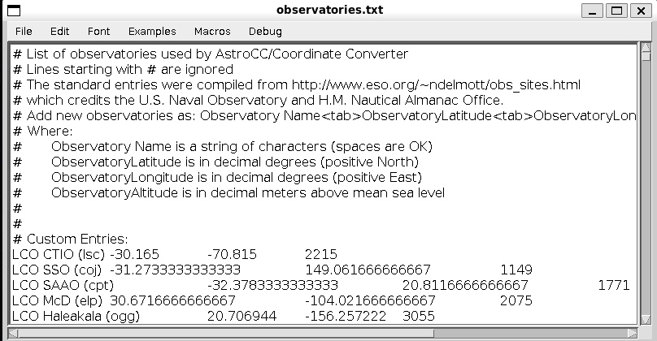

This page will help with installing the latest Version 6 of AstroImageJ on Linux operating systems, 
or upgrading from a previous Version 5 installation. Upgrading from a previous version is reccomended, 
as it will automatically migrate the memory setting and custom observatories. Other preferences will be
migrated even if using a new installation. These instructions should work on any Linux distribution. 
They have been tested most recently with OpenSUSE Tumbleweed.

### New Installations

On a Linux operating system the installation should be for one user and installed in that user’s own space. 
The executable `AstroImageJ` should be in the search path once the installation is done.  
One solution is to create a directory (folder) within your home directory and call it `local`.  
Then within `local`, create a `bin` directory and put it in your search PATH. 
With that you can put any locally installed software under `local` and links to the executables in `bin`.

For a fresh installation begin with [https://astroimagej.com](https://astroimagej.com) and look for the “Download Now” button



After clicking on it you will be offered an installation package for your operating system



Github will provide a compressed tar file with a name such as `AstroImageJ-6.0.3.00-linux-x64.tgz`.

Move or copy this file to your preferred location, and unpack it

```bash
tar xvf AstroImageJ-6.0.3.00-linux-x64.tgz
```

to create an `AstroImageJ` directory with two sub-directories `bin` and `lib`. The executable `AstroImageJ` is in the
bin directory. You can add this directory to your search PATH, or in a directory that is already in your PATH, 
create a link to the executable.  For example, if you have a `bin` in your home directory

```bash
cd ~/bin
ln -s ~/local/AstroImageJ/bin/AstroImageJ aij
```

will create a softlink that points to the executable.  By entering `aij` in a console or terminal you will start 
AstroImageJ. Alternatively, create a desktop link using the tools of your preferred window manager.

### Upgrading

If you are running a version of AstroImageJ earlier than version 5, locate the directory in which it is installed and 
delete it.  Follow the instructions above for a new installation.

If you are running version 5, you may either delete it and create a new installation, or follow the automated update process in this way:

* Start AstroImageJ using your usual method
* Click on the “Help” option on the main menu bar
    
* Follow the instructions presented through a two-step sequence
  * The first step will load a version that bridges to version 6
  * The second step will download version 6, delete your old version, and replace it with the new one
* The upgrade process adds a softlink in the AstroImageJ directory that should allow your previous `PATH` to 
  the executable to work with the new version

In the event this upgrade process fails, say from a timeout for file downloads, 
delete the AstroImageJ directory and follow the instructions for a new installation.

### Known Linux Issues

The upgrade process may fail to complete if the network connectivity to GitHub is slow or has latency in communication. 
In that case, take the easy route, make a coffee, and start a manual download. Using Linux you have full control on 
where you want to put the software and how you start it.

### Using AstoImageJ

That's it! AIJ should now start up normally for you.  If you are new to AstroImageJ, 
look at the preferences menu to see what you can customize



If you have other users on this computer, consider installing a separate instance for them rather than a common 
core of software. This will keep their work distinct from yours.  AIJ will multitask and make efficient use of 
your computer’s resources on your behalf.

#### Setting Memory

By default, AIJ will be configured to use at most 75% of the system's total memory. This can be adjusted in the settings:



#### Setting Custom Observatory Locations

To optionally add custom observatories, open the Coordinate Converter.


Then enable `Use custom observatory list`, and select `Edit Custom Observatories List`.


Then add any custom obersvatories to the file.


Observatories are written in a tab-delinated format, with one observatory per line. Lines that begin with a `#` will
be ignored. The order in which the observatories appear in the file is how they will appear in the selection dialog.

> **Name**`<tab>`**Latitude**`<tab>`**Longitude**`<tab>`**Altitude**

| Entry     | Description                                                                                            |
|-----------|--------------------------------------------------------------------------------------------------------|
| Name      | The observatory name. A string of characters (spaces are OK). This is what will show in the selection. |
| Latitude  | Decimal degrees (positive North)                                                                       |
| Longitude | Decimal degrees (positive East)                                                                        |
| Altitude  | Decimal meters above mean sea level                                                                    |


Example:
```tsv
# Custom Obersvatories
The Sphinx  29.975413 31.137979 20
LCO CTIO (lsc)	-30.165	-70.815	2215
```

---

Have questions or want to contribute? Reach out to us!

AstroImageJ User Technical Support: [Nabble User Forum](http://astroimagej.170.s1.nabble.com/)

GitHub Discussions: [Github AIJ User Discussions](https://github.com/AstroImageJ/astroimagej/discussions)

GitHub Issues: [Report a confirmed bug or new development request](https://github.com/AstroImageJ/AstroImageJ/issues)
