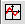
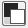
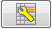

:::danger
This user guide is for an older version of AIJ and is very out of date. 
We are hoping to update the user guide soon, in the meantime, please refer to 
[Dennis Conti's guide](http://www.astrodennis.com/Guide.pdf)

:::

**AstroImageJ an image analysis tool for astronomy**

website: <https://astroimagej.com>

support forum: <http://astroimagej.1065399.n5.nabble.com/>

Feature Overview

- General purpose, but optimized for time series aperture photometry

- Open source and written in Java, so runs under Windows, OS X, Linux

- Real-time or post-processed calibration, analysis, and plotting

- DS9-like image display with live photometer and WCS support

- Astrometry.net “plate solve” capability (internet connection required)

- FITS header handling, viewing, editing

- Multi-image processing (bias, dark, flat, CCD non-linearity
  correction)

- Multi-exposure, multi-aperture differential photometry

- Interactive multi-curve plotting

- Interactive lightcurve detrending

- Astronomical coord. conversion (J2000, EoD, equatorial, ecliptic,
  galactic)

- Astronomical time conversion (UTC, local, LST, JD, HJD,
  BJDTBD)

# Introduction

AstroImageJ (AIJ) is simply generic
[ImageJ](http://rsb.info.nih.gov/ij/download.html) (IJ) with
customizations to the base code and a packaged set of astronomy specific
plugins. AIJ and IJ are public domain Java image processing programs
inspired by NIH Image for the Macintosh. IJ was developed by Wayne
Rasband at the National Institutes of Health. The plugins are based on
the Astronomy Plugins package
written by Frederic V. Hessman et al. of [Inst. f.
Astrophysik](http://www.Astro.physik.Uni-Goettingen.de),
Georg-August-Universität Göttingen. The AstroImageJ customizations are
written by Karen Collins (karenacollins --- at --- outlook.com) and John
Kielkopf of the University of Louisville. The application is open
source, and the source code is embedded within the ij.jar file and the
Astronomy\_.jar file. To report bugs or suggest new features, please
email Karen Collins at the address indicated above.

For a step-by-step guide to getting started with AIJ, jump to section
10.

# Installation

Java must be installed on a computer before running AstroImageJ. Java
64-bit is strongly recommended if supported by your OS. Java can be
downloaded from:

<http://www.java.com/en/download/manual.jsp>

AstroImageJ can be downloaded from:

<https://astroimagej.com>

## Linux Installation

Download AstroImageJ for Linux from:

<https://astroimagej.com>

and extract "AstroImageJ\_\*\_linux.tar.gz" to the desired AstroImageJ
folder. A script file is available that shows how to set up AIJ for easy
start-up under Linux. For Linux installation, refer to the Linux section
of the “AA\_README\_AIJ” page on the website. For more information on
generic ImageJ with Linux, go to:

<http://rsbweb.nih.gov/ij/docs/install/linux.html>.

## Windows Installation

Download AstroImageJ for Windows from:

<https://astroimagej.com>

and extract "AstroImageJ\_\*\_windows.zip" to the desired AstroImageJ
folder (ex: C:\Program Files (x86)\\ ). Be sure to read the Windows
section of the “AA\_README\_AIJ” page on the website. An AstroImageJ.exe
program is available in the upper most directory and can be used to
start AstroImageJ. If preferred, one can set up a file type to be
automatically opened by AstroImageJ.exe when double clicked by
referencing that file type to the AstroImageJ.exe program. To change the
maximum amount of memory allocated to AIJ, start AIJ using the
ImageJ.exe program, and then go to the Edit/Options/Memory&Threads… menu
selection on the AIJ toolbar. After changing the maximum memory
allocation, close and restart AIJ to enable the new memory setting. Do
not start AIJ by double clicking on ij.jar, because no more than 64MB of
memory will be allocated to AIJ. For more information on generic ImageJ
with Windows, go to:

<http://rsbweb.nih.gov/ij/docs/install/windows.html>.

## Mac OS X Installation

Download AstroImageJ for Mac OS X from:

<https://astroimagej.com>

by clicking on "AstroImageJ\_\*\_mac.zip". After the download completes,
extract the zip file to the AstroImageJ. Move this folder to the
Applications folder, open it, and copy either *AstroImageJ* or
*AstroImageJ64* to the dock or desktop for easy access. *AstroImageJ*
runs in 32-bit mode using Java 1.5 (Java 1.4 on OS X 10.3) and
*AstroImageJ64* runs in 64-bit mode using Java 1.6+. *AstroImageJ64* is
not limited to 1800MB of memory but it requires a 64-bit Intel Mac
running Mac OS X 10.5 or later. The "AstroImageJ\_\*\_mac.zip" file can
be deleted.  For more information on generic ImageJ with Mac OS X, go
to:

<http://rsbweb.nih.gov/ij/docs/install/osx.html>.

There are several workarounds required for some OS X versions.

Since OS X 10.7 (Lion), Java is no longer pre-installed so you are
prompted to install it the first time you install a Java application.

With OS X 10.8 (Mountain Lion), you may get the message "AstroImageJ64
is damaged and can't be opened". To work around this problem, go to
System Preferences -&gt;Security & Privacy -&gt; General and set "Allow
applications downloaded from:" to "Anywhere". You can restore the
original setting once AstroImageJ is running the first time.

AstroImageJ does not work with Oracle Java 7 because the Apple launcher
it uses does not support Java 7. To use Java 7, you have to move it to
the top of the list in /Applications/Utilities/Java Preferences and run
AstroImageJ from the command line using something like "java -jar
-Xmx640m ij.jar".

# Update AIJ to latest version

After you have installed the full installation package as described in
the previous section, always update AIJ to the latest version using the
semi-automatic upgrade facility in AIJ (you may need root user access
for this feature to work properly since it writes files to your
installation folder). To update, go to AIJ Toolbar-&gt;Help-&gt;Update
AstroImageJ. Select the latest build in the pull down menu (the latest
released build is the default). Click OK and files will be downloaded
and automatically installed in the proper location on your computer.
After the files have been installed, AIJ will automatically close. When
you restart AIJ, you will be running the new version.

# AstroImageJ vs. Generic ImageJ

## Important Notes

This user guide assumes that the astro-mode icon is selected on the AIJ
Toolbar as shown in Figure 1 and as a result the image is displayed in
the AIJ interface shown in Figure 2. In the default mode, all images are
opened in this format. If any of the IJ specific tools are selected (the
icons to the left of the astro-mode icon), operation will revert to
standard IJ operation. Clicking back on the astro-mode icon will revert
to AIJ operation.

A three button mouse with a scroll wheel and separate middle mouse
button, such as the Logitech Anywhere MX mouse, provides the most
convenient and efficient AIJ operation.

## AstroImageJ Toolbar

When AstroImageJ (AIJ) is opened, you will see the AIJ Toolbar as shown
in Figure 1 with eight AIJ-specific icons on the right side of the
toolbar, starting at the button shown depressed below. The toolbar can
be used the same as for generic IJ, but for most operations with AIJ,
you will want the “star-field” icon depressed as shown below. The icon
is called “Astronomy Tool” in the menubar and this mode is referred to
as astro-mode in this document. AIJ defaults to this mode at startup. An
overview of each icon button is provided below.

NOTE: although the right-hand portion of the toolbar can be customized
as with generic IJ, it is highly recommended to leave the default AIJ
icons installed as shown below.

Figure 1. AstroImageJ Toolbar with AstroImageJ tools on right-hand side

 <u>Astro-Mode Icon</u> – this
button should normally be in the selected/pressed state for AIJ
operation. When the button is in the deselected state, mouse, keyboard,
and image display manipulation revert to standard ImageJ operation. This
button will go into the deselected state if one of the base IJ toolbar
icons has been pressed to draw a square, circle, etc., Region of
Interest (ROI) on the image. These ROIs are not normally needed for AIJ
operation, but may be useful for custom measurements. After drawing a
ROI, remember to press the astro-mode icon to return to astro-mode.
Pressing one of the following AIJ toolbar icons will not change the
astro-mode state.

 <u>Data Processing Icon</u>
– opens the Data Processing (DP) module to perform image calibration
(bias, dark, flat, linearity correction), and to optionally perform FITs
header updates, plate solve to add WCS FITS headers (requires internet
access and free user key from nova.astrometry.net), run Multi-Aperture,
and/or Multi-plot after each image has been calibrated. DP works in
post-processing mode by setting “Polling Interval” to zero, or works in
“real time” mode at the telescope by setting the polling rate to a
non-zero value (5 seconds tends to work well). DP runs independent of,
and in parallel with, any camera/telescope control software.

 <u>Multi-Aperture Icon</u> –
opens the Multi-Aperture (MA) photometry module to perform differential
photometry on a series of (usually already calibrated) images. A series
of images can be opened into an AIJ “Stack” by using the AIJ toolbar
menu item File-&gt;Import-&gt;Image Sequence. This icon is also
available above all image windows. MA can be automatically started as
part of a DP run, however it is often necessary to run MA on data that
has already been calibrated. Multi-aperture outputs a table containing
the photometry results.

 <u>Multi-Plot Icon</u> –
opens the Multi-Plot (MP) module for plotting multiple curves on a
single plot from the data table created by MA or any generic table
opened from disk. A data file can be opened by dragging and dropping it
onto one of the two MP control panels (or use the MP file menu). A saved
plot configuration will be automatically opened at the same time if a
file with the same name, but with suffix .plotcfg, exists in the same
folder as the dropped file.

 <u>Open Data Icon</u> –
opens a previously saved measurements table (or any generic tab, comma
(.csv), space (.spc or .prn), or white space (.txt) delimited file) from
disk for plotting with MP. Alternatively, a data file can be opened by
dragging and dropping it onto one of the two MP control panels. A saved
plot configuration will be automatically opened at the same time if a
file with the same name, but with suffix .plotcfg, exists in the same
folder as the dropped file.

 <u>Coordinate Converter
Icon</u> – opens the astronomical coordinate and time converter module.
This feature retrieves coordinates from SIMBAD and converts them to
other standard astronomical coordinate systems. It converts time for
those coordinates and a specified observing location to/from UTC, local
time, Local Sidereal Time (LST), Julian Date (JD), Heliocentric JD
(HJD), and Barycentric JD (BJDTBD). Lunar phase and proximity
of the moon and of all major planets in the solar system are also
provided. Archival sky images can be displayed via the SKY-MAP.org
website.

 <u>Single Aperture
Photometry Icon</u> – when selected, single aperture photometry will be
performed by left-clicking the mouse at the desired location in an
image. Single aperture photometry can also be performed, even if this
icon is not depressed, by holding the shift key when left clicking in an
image. If the centroid feature is enabled, the aperture will be placed
at the nearest centroid location. The photometry results will be output
to a measurements table and can be plotted or saved to disk.

# AstroImageJ Image Display Interface

When a FITS image or any other supported image type is opened, the image
will be displayed in a window as shown Figure 2.

Figure 2. AstroImageJ Image Display Interface

## Data Displayed Above the Image

AIJ displays several data fields above the image that contain
information specific to the mouse location within the image. All of
these values update as the mouse is moved. Two pixel coordinate systems
are displayed in the interface. IJ’s native origin (i.e. x,y = 0,0) is
at the top left of the image with “x” increasing to the right and “y”
increasing toward the bottom. IJ pixel coordinates are useful when using
some of the built-in IJ features. The FITS standard origin is at the
bottom left of the image with “x” increasing to the right and “y”
increasing toward the top. Pixel coordinates based on the FITS standard
are often needed by astronomers and are particularly important when
working with images containing World Coordinate System (WCS) headers.
The middle line displays RA and DEC when WCS headers are available from
a FITS file. The top right box labeled “Value” indicates the pixel value
under the mouse cursor. The “Peak” value indicates the highest pixel
value within a circular aperture at the mouse cursor, however if enabled
in Preferences menu, this label will read “Mean” and the value in the
box is the mean within the aperture. The aperture characteristics can be
set by clicking the “Set Aperture” Icon
() and the mouse aperture
display can be enabled/disabled under the Preferences menu. The “Int
Cnts” value displays the sum of all the pixel values within the aperture
(less the mean of the pixel values in the background annulus). The “Int
Cnts” box label changes to either “Length” or “Arclen” to report length
in pixels or arclength in decimal or sexagesimal format when the mouse
is being dragged with the middle mouse button depressed. Sexagesimal
format can be selected/deselected in the Preferences menu. If WCS
headers are available or if the pixel scale of the image has been set
under the Preferences menu, arclength will be displayed. Otherwise,
distance in pixels will be displayed. The length data can be written to
a log window and saved if desired by selecting the corresponding option
in the Preferences menu.

## Data Displayed in the Image

The blue *zoom box* displayed in the up left of the image indicates the
faction of the image that is currently displayed. The size of the zoom
box can be set under the preferences menu. The green *Y-arrow* points to
what would be the top of the image prior to any inverting/rotating (see
the View menu). The green *X-arrow* points to what would be the right of
the image prior to any inverting/rotating. The N and E directional
arrows and the distance scales show in either red or yellow. If WCS
headers are found in the image, the display color is yellow and the
directions and scales will be automatically set. If no WCS headers are
found, the display color is red. In the case of no WCS headers, the
directions and scales can be set under the WCS menu.

Display of each of the zoom box, X- and Y-direction arrows, N- and
E-direction arrows, and the image scale indicator can be independently
enabled or disabled under the View menu.

## Contrast/Brightness Adjustment

Under the Scale menu, select either auto brightness & contrast (based on
the image’s pixel value standard deviation), fixed brightness & contrast
(keeps the same user defined levels from image to image), or full
dynamic range (displays the full range of pixel values in the image).
The selected option is saved and recalled when new images are opened or
a new image is displayed in a stack. The “black” and “white” values
indicated below the histogram can be directly entered in any mode, but
if auto mode is selected, they will update when the image is updated or
another image is opened. The “min” and “max” histogram values are
normally automatically set to the min and max pixel values of the
displayed image. However, the values can be directly entered and will
not change from image to image if the Scale menu item “Use fixed min and
max histogram values” is enabled.

AIJ provides a number of ways to adjust the contrast and brightness of
an image. The simplest way is to click the “Auto Scale” button above the
image. Auto-scale displays a range of pixel values based on a constant
factor times the standard deviation of the images pixel values. If the
default settings do not display the desired results, the constant
factors can be changed by the user under the Scale menu. Alternatively,
the arrows that define the blue region of the histogram can be dragged
to adjust the image display manually. The currently displayed range of
pixel values is highlighted in blue in the histogram. The blue region
can be dragged with the mouse to adjust the brightness. The pixel value
corresponding to black is indicated in the histogram “black” box, and
the pixel value corresponding to white is indicated in the “white” box.
These numbers can be directly modified by clicking on an existing number
and typing a new value and pressing &lt;Enter&gt;. Alternatively, a
right mouse drag in the image will control the image brightness/contrast
similar to DS9. When right-click dragging, watch the histogram to see
how the motion affects the settings. Right-dragging the mouse up and
down changes the image brightness (moves the range of values displayed
up and down the same as dragging the blue region in the histogram).
Right-dragging right and left changes the contrast by increasing and
decreasing the width of the displayed range of pixel values.
Alternatively, pressing the shift key while rolling the mouse wheel
adjusts the image brightness and pressing the control key while rolling
the mouse adjusts the contrast. To return to auto-scale setting, click
on the  icon above the image.

## Image Negative

AIJ can display an image as a “negative” by selecting the “display as
image negative” icon  above the image. AIJ uses an
inverting lookup table to display the image rather than modifying the
underlying image. In this mode, high pixel values are displayed as
black, and low pixel values are displayed as white.

## Image Invert (Flip) and Rotate

The image displayed in an AIJ astro-mode window can be inverted/flipped
in the X- and/or Y-axis and/or rotated by 0 or 180 degrees by using the
View menu above the image. The View menu options change only how an
image is displayed, and do not change the orientation of the data in the
underlying image in memory. To flip or rotate the underlying image, use
the Flip and Rotate options under the Process menu above an image. AIJ
does not currently support rotation of images by 90 or 270 degrees (or
arbitrary angles). These display features will be included in a future
release of AIJ.

## Panning

Left click and drag the mouse to pan the image. A middle mouse click
will center the image at the clicked location (if enabled under
preferences).

## Zooming

If using a mouse with a scroll wheel, the wheel can be used to zoom in
and out of the image. Place the mouse cursor at the point in the image
where the zooming should take place and roll the wheel. If a mouse wheel
is not available, click in the image at the desired zoom point and use
the zoom buttons above the image
, or press "control" and left
click to zoom in, or "control" and right click to zoom out. Press the
“zoom-in fast” button  above the image or double
left-click in the image to zoom in “fast”. Double right-click to zoom
out such that the image will fill the available area in the image
display. Press the “zoom to fit” icon
 or triple right click to zoom
out such that the full image is displayed on the screen (which may leave
white space at top/ bottom or left/right of the image). The keyboard up
arrow or plus key will zoom in at the last clicked location in an image,
while the keyboard down arrow or minus key will zoom out.

## Mouse Pointer “Live” Photometer

AIJ offers a “live” photometer which follows the mouse pointer around in
the image and provides a peak pixel count in the aperture (or mean pixel
count if selected in the Preferences menu) and a sky subtracted
integrated count in the aperture. The photometer radius and inner and
outer background radii can be set by clicking the “change aperture
settings” icon  above the image. Display of
the photometer can be disabled by deselecting the Preferences menu item
“Show photometer regions at mouse cursor”. The photometer peak and
integrated counts will be updated above the image, even if the
photometer annuli are not showing.

## Single Aperture Photometry

Shift left-click on the mouse to run the single aperture photometer, or
click the “Aperture Photometry Tool” icon
 on the AIJ toolbar. The
single aperture photometer results are listed in a measurements table
and can be saved or plotted using Multi-Plot. The data values reported
can be set by clicking the “change aperture settings” icon
 above the image, or by
selecting Edit-&gt;Aperture Settings in the menus above the image, or by
double clicking on the “Aperture Photometry Tool” icon
 on the AIJ toolbar. See the
Aperture Settings section for more details. Apertures displayed on an
image can be removed by clicking the “clear apertures overlay” icon
 above the image.

## Apertures Displayed in the Image

Apertures are displayed as a non-destructive overlay on the image at the
mouse curser (if enabled in Preferences), as a result of single aperture
photometry, or multi-aperture photometry. Display of the background
annulus of apertures from all three sources can be enabled or disabled
by clicking the “display sky background regions” icon
 above the image. The “display
source integrated counts” icon
 is applicable for both
single and multi-aperture photometry, while the “display source
identification” icon  is applicable only to
multi-aperture photometry. The displayed source IDs indicate which
aperture is related to similarly identified data in the measurements
table. The “centroid aperture” icon
 enables or disables the
aperture centroid feature and is applicable to both single and
multi-aperture photometry. Finally, the “clear aperture overlay” icon
 removes all apertures from
the image.

## Measuring Arclength

A middle mouse button click and drag shows distance in arclength in the
bottom right box at the top of the image when a pixel scale is set in
the Preferences menu or WCS headers are available. Otherwise length is
shown in pixels. Click the “clear apertures overlay” icon
 to remove the line that was
drawn during the measurement. Two Preference menu options are available
to enable image data to be written to a log file when the middle mouse
button is clicked or dragged. The resulting log file can be saved if
desired.

## Image Stack Display

Image sequences can be opened into an AIJ “stack” by using the AIJ
toolbar menu item File-&gt;Import-&gt;Image Sequence, or
directory/folder containing an image sequence can be dragged and dropped
on the AIJ toolbar. When a sequence of images has been opened into an
AIJ image “Stack”, they will be displayed in a single window as shown in
Figure 2, with the addition of a stack control bar inserted between the
image and histogram display as shown in Figure 3. The slider can be
dragged left and right to move through the images, or the left and right
arrow buttons on either end can be used to move through the images one
at a time. The keyboard left and right arrow keys will also move through
the images one at a time. The play icon
 will display the stack as an
animation. Right click the play icon to set the animation speed and
other parameters. To delete the currently displayed image from a stack
(i.e. the current slice), click the
 icon above the image. The
image is only removed from the stack in AIJ memory, and is not deleted
from the disk. The delete current image feature will not delete the last
two images of a stack.

Figure 3. Stack Control Panel

## Other Stack Related Icons above the Image Display

 <u>Clear Table Icon</u> –
clears all data in the measurements table that is created by Single- or
Multi-Aperture. This button is useful when running back to back
Multi-Aperture sessions and the user desires to quickly delete the data
from the previous session. WARNING: there is no undo for this operation!

 <u>Multi-Aperture Icon</u> –
opens the Multi-Aperture (MA) photometry module to perform differential
photometry on a series of (usually already calibrated) images.

 <u>Image Alignment Icon</u>
– opens the AIJ Stack Aligner module. Stack Aligner allows the user to
place apertures at one or more reference stars in a reference image of a
stack. It then uses the centroids of those reference stars in each image
to align to the reference image by translating the image in the x- and
y-axes (image rotation is not supported).

 <u>Plate Solve Icon</u> –
opens the AIJ plate solve setup panel. Plate solving requires an
internet link and a free user key from nova.astrometry.net.

 <u>FITS Header Editor
Icon</u> – opens the AIJ FITS Header Editor module. This feature allows
the user to view or edit the FITS header associated with an image. See
FITS Header Viewing and Editing section for more details.

## Menus above the Image Display

Pull-down menus are provided at the top of the image display to allow
direct access to many features commonly used by astronomers.

<u>File menu:</u> provides several options for opening and saving image,
stack, and data files. The “Save image display” option saves the
displayed image to a PNG or JPG file, using the displayed size and
current contrast settings, and includes all information and apertures
displayed in the image. Other save options will save the full resolution
image without the overlay information and/or the displayed apertures.
The first image will need to be opened from either the OS by double
clicking it (if a file type association has been set up), or by dragging
and dropping a file onto the AIJ toolbar, or by using the AIJ toolbar
File menu. Subsequent images can be opened from the AIJ File menu above
an image, by dragging and dropping a file onto an existing image (opens
in same window) or the AIJ toolbar (opens a new window), through the OS,
or through the AIJ toolbar File menu.

<u>Preferences menu:</u> provides several options for changing how an
image is displayed. When an image is closed, its preference settings are
saved to ImageJ memory. If multiple image windows are open and the
preference settings in more than one window have changed, the settings
of the last window closed are saved over any other previously saved
settings. Preference settings are not saved to hard disk until AIJ
closes, so if AIJ crashes or is terminated improperly (using something
like “killall imagej” in Linux), the settings will not have been updated
in the IJ\_Prefs.txt file for use the next time ImageJ is started. 

<u>View menu:</u> provides several options for setting the displayed
orientation of an image and for enabling informational overlays. The
“Clear Overlay” option clears any apertures or ROIs drawn on the image,
but not the informational overlays. The View menu options are
non-destructive and do not change the underlying image data.

<u>Edit menu:</u> provides options to edit various data associated with
an image or stack. These options include editing of aperture settings,
base IJ measurement settings, FITS header entries, and stack
configuration.

<u>Process menu:</u> provides various tools to modify the data within an
image.

<u>Analyze menu:</u> provides several options to measure the data within
an image and to plot and/or save those results. These options do not
modify the image data.

## Notes on Generic ImageJ Regions of Interest 

Some of the items in the Analyze menu require a region of interest (ROI)
to be defined within an image before running that selection. The most
commonly used ROI shapes are oval, rectangular, and line. ROIs can be
drawn by clicking on the related icon on the AIJ toolbar, however,
astro-mode panning and other convenient mouse functions will be lost
while the ROI is being drawn. If you use the AIJ toolbar to draw the
regions, remember to click on the astro-mode icon after you are finished
to restore astro-mode functionality. Short cuts are available to draw
these three common ROI shapes without leaving astro-mode. Press and hold
&lt;shift&gt; while left dragging to draw an oval ROI. Press and hold
&lt;control&gt; while left dragging to draw a rectangle ROI. Press and
hold &lt;alt&gt; while left dragging to draw a line ROI. To move or edit
an existing ROI, press and hold the &lt;tab&gt; key, then use the mouse
to point at the ROI and drag it to the new location. To edit the shape
of an ROI, hold the &lt;tab&gt; key and hover the mouse cursor over one
of the ROI selection points until it changes to a finger shape, then
click and drag to change the ROI shape. Currently, to modify
nonsymmetrical ROIs, it may be necessary to set the image orientation to
“Invert None” and “0 degrees” under the View menu. It may be quicker to
simply redraw the ROI using the shortcuts described above. This issue
will be resolved in a future AIJ release. ROIs can be cleared by
clicking the “clear aperture overlay” icon
 above an image, or by using
the View menu “Clear Overlay” selection.

# Data Processor (DP) Module

## Overview of Operation

To start a data processing / data reduction session, click the DP icon
on the AIJ toolbar or use an image’s menu selection Process-&gt;Data
Reduction Facility. DP operates much like a script in that it processes
selected calibration and science images in a predefined sequence. Fields
are provided to define the directory/folder locations and file name
patterns of data to be processed. Checkboxes are provided to enable and
disable various tasks that can be included in the data processing
session. Each option or field in the display has “tool-tip” help that
pops up when the mouse pointer is positioned over the item for more than
about a second. The tool-tip will disappear after 3-4 seconds. The user
often needs more than a few seconds to read the sometimes lengthy
information, so to keep the text displayed longer, the mouse pointer can
be slowly moved over the item after the tool-tip is displayed. Input and
output files can be any format supported by generic ImageJ. The input
and output formats may be the same or may be different. For example,
FITS files can to be processed as input, and a TIFF files to be written
as output.

## Post-Processing vs. Real-Time Operation

DP can be used in “post-processing” mode by setting the *Polling
Interval* at the bottom left of the DP panel to zero. In this mode, DP
will process all images as set up in the control panel and then stop. DP
can be used in “real-time” processing mode by setting the polling
interval to a non-zero value. A value of 5 (for 5 seconds) is a good
starting point. In real-time mode, all images matching the settings in
the DP panel will be processed, and after the polling interval time, DP
will scan the science image directory/folder for new files matching the
patterns specified. Each time new matching files are found, they will be
calibrated, and then optionally, Multi-aperture and Multi-plot can be
enabled to run for each new image, thus performing photometry and
lightcurve plotting in real-time as new exposures are being written from
the camera.

## DP User Interface

The DP graphical user interface is organized into five sections
horizontally and nine sections vertically as shown in Figure 4.

Figure 4. Data Processor User Interface

### Horizontal Sections

Starting from the left, the horizontal sections are labeled at the top
of the panel as:

#### Control

The control checkboxes allow each of the possible processing
capabilities to be enabled or disabled. In general, the processing steps
run in sequence from the top to the bottom of the panel.

#### Options

The options checkboxes allow various options to be enabled or disabled
for each processing step. Although the Macro 1 and Macro 2 checkboxes
fall under the Options heading, they are Control settings to enable or
disable user created ImageJ macros as part of the data processing
sequence.

#### Directory

The directory boxes define the directory/folder location of each
category of image files. The directory path is automatically entered
when a filename pattern is selected (see below), or the directory path
can be directly typed into the box, or the associated solid blue folder
icon can be used to navigate to and select a directory. The raw and
master calibration file directories can either follow the science
directory path, or can operate independently by setting options in the
Preferences menu at the top of the DP panel. If a directory box is
empty, it will follow the science directory as well. Unix/Linux/Dos
current directory notation (.) can be used to reference the science
directory followed by relative subdirectory specification. For example,
“./darks” refers to a subdirectory of the science directory called
darks. The notation for “up one directory” (..) can also be used to
reference a parent directory. For example, “../../cals” refers to a
directory two levels up called cals.

#### Filename/Pattern

The file name pattern boxes specify which files in the directory are to
be processed. Unix wildcard notation using “?” and “\*” should be used
to define the filename patterns. The blue and white folder icon to the
right of each box can be used to navigate to a sample file that should
be processed. When a file is selected, the associated directory path is
loaded into the corresponding directory field, and the file name is
loaded into the filename pattern field. By default, a “\*” is
automatically placed between the last underscore and last dot characters
in the filename, if both exist. This behavior can be disabled in the
preferences menu at the top of the DP panel.

#### Totals

The totals column indicates the number of files found that match each
directory plus file name pattern. The Control Panel section totals at
the bottom of the panel indicate the number of files that have already
been processed and the number of files remaining to be processed.

### Vertical Sections

Starting from the top, the vertical sections are labeled in the border
of each section as:

#### Science Image Processing

This section is divided into two subsections. In the *Filename Pattern
Matching* subsection, the directory and file name pattern should be set
up, and enabled. If this subsection is disabled, only master calibration
files will be built, if enabled. Enable the *Sort Num* option to process
the matching images in numerical order. An image file name’s numeric
value is determined by combining <u>all</u> of the numeric digits in a
matching filename. The value under *Totals* indicates the number of
files AIJ has found that match the defined pattern. If the subsection is
disabled, the *Totals* value will be zero.

The *Filename Number Filtering* subsection can be used to filter out
files that match the file name pattern, but should not be included in
processing if the file’s numeric value is less than or greater than
specified values in *Min* and *Max*. The file name pattern in this
subsection can be used to define which characters in a file name should
be included when determining the numeric value of the file name. Only
numeric characters in a filename that fall under “\*” or “?” characters
in a pattern are used to determine a file name’s numeric value. If the
full pattern is contained in a filename, numeric characters after the
pattern in the filename will also be included (e.g. the file name
*mars01a34out.fits* with a pattern of *mars* has a numeric value of
134). The file name pattern in the number filtering subsection follows
the pattern in the pattern matching subsection, but can be altered after
the pattern matching text has been entered.

#### Bias Subtraction

This section allows the user to define locations and file names for raw
and master bias images. The use of a master bias image is not required
in general, but is required for exposure time scaling and non-linearity
correction. If a master bias file has already been created, and it is to
be used to reduce the science data, deselect *Build*, select *Enable*
and then point to the master bias file using the lower directory and
file name fields. To first create a master bias file from raw images,
also select *Build*, and then select either *ave* or *med* to build the
master by average or median combining the images. Also specify the
location and file name pattern for the raw files on the upper line of
this section. The master bias file will be saved at the location
specified on the lower line, and then as each science file is processed,
the same master bias file will be used to bias subtract the science
data. The value under *Totals* for the top line specifies the number of
raw bias files matching the defined pattern, and the value on the lower
line indicates how many files match the master bias file name (usually
one or zero).

#### Dark Subtraction

This section allows the user to define locations and file names for raw
and master dark images. If a master dark file has already been created,
and it is to be used to reduce the science data, deselect *Build*,
select *Enable* and then point to the master dark file using the lower
directory and file name fields. To first create a master dark file from
raw images, also select *Build*, and then select either *ave* or *med*
to build the master by average or median combining the images. Also
specify the location and file name pattern for the raw files on the
upper line of this section. The master dark file will be saved at the
location specified on the lower line, and then as each science file is
processed, the same master dark file will be used to dark subtract the
science data. The value under *Totals* for the top line specifies the
number of raw dark files matching the defined pattern, and the value on
the lower line indicates how many files match the master dark file name
(usually one or zero).

If the *scale* option is enabled, the master dark pixel values will be
scaled according to the ratio of the science image exposure time (or raw
flat image exposure time in the case of master flat creation) to the
master dark exposure time. The master dark image must be bias subtracted
and the exposure time must be available in both FITS headers for this
feature to work as expected. See the *FITS header Updates* section for
compatible exposure time keywords.

IMPORTANT NOTES: If bias subtraction is not enabled, master darks
created will contain the bias signal. If bias subtraction is enabled,
master darks created will be bias subtracted using the master bias file
defined in the bias subtraction section. If *Non-Linearity Correction*
is *Enabled* AND *Bias Subtraction* is *Enabled*, the bias-subtracted
dark is scaled using the three coefficients specified in the
*Non-Linearity Correction* section.

#### Flat Division

This section allows the user to define locations and file names for raw
and master flat images. If a master flat file has already been created,
and it is to be used to reduce the science data, deselect *Build*,
select *Enable* and then point to the master flat file using the lower
directory and file name fields. To first create a master flat file from
raw images, also select *Build*, and then select either *ave* or *med*
to build the master by average or median combining the images. Also
specify the location and file name pattern for the raw files on the
upper line of this section. The master flat file will be saved at the
location specified on the lower line, and then as each science file is
processed, the same master flat file will be used to flat-field the
science data. The value under *Totals* for the top line specifies the
number of raw flat files matching the defined pattern, and the value on
the lower line indicates how many files match the master flat file name
(usually one or zero). The Preferences menu contains an option to
*Remove gradient from calibrated raw flats when creating master flat*.
If you suspect that your flat-field surface (sky, dome, etc.) is not
evenly illuminated, this option will fit a plane to all calibrated
flat-field images and divide out the illumination gradient prior to
combining the raw images.

IMPORTANT NOTE: When building a master flat, unless all raw flat images
are of the same exposure time as the master dark image, it is necessary
to have a master bias file defined and enabled so that a bias subtracted
master dark can be exposure time “scaled” to match the exposure time of
each raw flat. DP does not currently provide the capability to use
multiple master dark images for different raw flat exposure times.

#### Non-Linearity Correction

This section allows the user to define a formula for the correction of
non-linear characteristics of a CCD. A master bias file must be defined
and enabled for this option to work properly. If non-linear behavior has
not been measured and characterized for your CCD, deselect this option.
Otherwise the correction formula coefficients entered in the three
fields will be used to correct the value of each pixel in a science
image after bias subtraction, but before dark subtraction and flat-field
division. If non-linearity correction is enabled while building master
dark and master flat images, the pixel values of the raw files will have
non-linearity correction applied after bias subtraction.

IMPORTANT NOTE: If non-linearity correction is used while processing
science files, the master calibration files should be created at the
same time, or should have previously been created using the same
non-linearity correction coefficients, and the same set of master
calibration files.

#### FITS Header Updates

This section provides the capability to add new keywords and values to
the output file FITS header. When this feature is enabled, a DP
“instance” of the Coordinate Converter (DPCC) module will be displayed
as shown in Figure 5. The DPCC window can be alternately displayed or
hidden by clicking the  icon in this section of the
DP GUI. DPCC will continue to operate as set up, even if the window is
closed/hidden. The DPCC instance runs independent of an instance started
by clicking the Coordinate Converter icon on the AIJ toolbar. Both
instances running at the same time may be confusing at first, but the
DPCC instance is differentiated by the DP prefix in the window title,
and the *Epoch of Interest* time entry fields will be disabled
(grayed-out), since DP automatically enters a time which must be derived
from the science image’s FITS header. Depending on settings described in
the following sections, other DPCC fields may be disabled as well. In
general, if data that is normally manually entered into a field of the
Coordinate Converter GUI is being derived from a FITS header value by
DP, the field and other associated fields will be disabled for manual
entry in DPCC.

Four categories of new keywords and values may be added to the output
image header, including target coordinates, observatory location,
airmass, and various time standards. To calculate new header values, DP
must be able to derive UTC-based start-of-exposure time and exposure
time from the science image header and the target coordinates and
observatory location must either be derived by DP from the science image
header, or the user must manually enter that data into DPCC before
starting the DP run. Figure 5 shows DPCC with all fields disabled, which
corresponds to a setup where all required data is being derived from the
science image’s FITS header. As science images are processed, all values
in the DPCC GUI, including the Phase-Altitude-Proximity indications,
will update to visually show the observing conditions during that
exposure.

Figure . DP Coordinate Converter User Interface

##### Exposure Start Date/Time Source

UTC start of exposure date and time must be defined in the science
image’s header by one of the following keywords: DATE-OBS, DATEOBS,
DATE\_OBS, UT\_DATE. If both date and time are not found in one of those
keywords, DP searches for the date only in the same keywords. If a date
is found, the following keywords are searched for UTC time: TIME-OBS,
TIMEOBS, TIME\_OBS, TM-START, TM\_START, UT, UTC, UTSTART, UT-START,
UT\_START, and UT\_TIME.

##### Exposure Time Source

Exposure time is required for the calculation of mid-exposure-based time
standards. The following keywords are searched for exposure time:
EXPTIME, and EXPOSURE. If neither is found, the following keyword pairs
are searched for exposure-start and exposure-end times: TM-START +
TM-END, TM\_START + TM\_END, UT-START + UT-END, and UT\_START + UT\_END.

##### Target Coordinate Source

The target’s coordinates can be provided in five ways by selecting the
desired *Target Coordinate Source*. If **Coordinate Converter manual
entry** is selected, the *SIMBAD Object ID* and all c*oordinate* fields
of DPCC will be enabled for user manual data entry. The target name
field or any coordinate system pair may be used to define the target’s
coordinates; however the &lt;Enter&gt; key must be pressed after typing
data into any field. If **FITS header target name** is selected as the
target coordinate source, all science images being processed must
contain a FITS header keyword as defined in the *FITS Header Settings*
panel which can be opened by clicking the
 button. The panel is shown
in Figure 4. The keyword containing the target name (not the target
name) should be entered in the field of the input settings section named
“Target Name Keyword”. The keyword value from a science image is
transferred to DPCC’s *SIMBAD Object ID* field, and an attempt is made
to resolve the object’s coordinates via a SIMBAD query. Internet access
is required for this option. The search is not case sensitive and all
underscore characters in the header value are replaced with a space
before starting the search. If no valid SIMBAD ID is found, DP will show
an error message and stop running. Duplicate target names from one
science image to the next will not trigger a new SIMBAD query. The
**FITS header target name (less trailing alpha char)** option works the
same as the previous option, however, if the object name has a trailing
alpha character, it is removed prior to the SIMBAD query. This feature
is useful since many exoplanet names in SIMBAD do not have proper motion
entries, while the host star name does. For example, at the time of this
writing, WASP-12 returns proper motion values from SIMBAD, while
WASP-12b does not. If **FITS header target RA/DEC (J2000)** is selected
as the target coordinate source, the science file headers must contain
keywords defined in “Target RA Keyword” and “Target DEC Keyword” and the
values of those keywords must be either a real number containing the
J2000 coordinate value, or a string containing a sexagesimal
representation of the J2000 coordinate value. The **FITS header target
RA/DEC (epoch of observation)** option works the same as the previous
option, however the values contained in the FITS header should be in
*epoch of observation* rather than J2000.

##### Observatory Location Source

The observatory location can be defined by one of three options under
the *Observation Location Source*. If **Coordinate Converter manual
entry** is selected, DPCC’s “Observatory ID” list is enabled for user
input. Select the observatory where the observations were conducted in
the observatory ID list. If the desired observatory is not listed,
choose “Custom Lon, Lat, and Alt entry” at the top of the observatory
list and enter the observatory’s coordinates and altitude manually in
DPCC’s “Geographic Location of Observatory” section. Full DPCC help is
available under the Help menu, including instructions on how to
customize the observatory list. If **FITS header observatory name** is
selected as the observatory location source, all science images must
contain the FITS header keyword defined in the “Observatory Name
Keyword” field of the *FITS Header Settings* input panel (see Figure 4).
The keyword’s value from the science image’s header is used to search
DPCC’s “Observatory ID” list. The first entry in the list that contains
the string from the header will be selected. The search is not case
sensitive and all underscore characters in the header value are replaced
with a space before attempting a match. If a match is not found, DP will
show an error message and stop running. If **FITS header latitude and
longitude** is selected as the observatory location source, the science
image headers must contain keywords as defined in the “Observatory
Latitude Keyword” and “Observatory Longitude Keyword” fields of the
*FITS Header Settings* input panel. The header values associated with
the keywords must be either real numbers or a string containing a
sexagesimal representation of the geographic location of the
observatory. The latitude value should be north-positive and the
longitude value should be east positive. If latitude is south-positive
or longitude is west-positive, check the appropriate *negate* box(es) in
the input settings panel.

##### FITS Header Output Settings

DP can automatically add new FITS header keywords and values to output
file headers if the input parameters have been set up as described in
the previous four sections. All of the keywords in the *FITS Header
Settings* panel “FITS Header Output Settings” section shown in Figure 4
are enabled by default. DP + DPCC will calculate those values and write
them to the output file headers. Each keyword name can be customized and
enabled/disable in the settings panel.

Figure 6. Data Processor FITS Header Settings

#### Save Calibrated Images

This section defines how calibrated output images are saved, if enable.
If *Enable* in the section is not selected, no images will be output to
disk; however, tasks in the Post-Processing section may still be applied
to the calibrated image in AIJ memory. Calibrated images can be output
in either 16-bit integer or 32-bit floating point pixel format by
selecting either *16* or *32*, if the output image format selected
supports the pixel format. Calibrated images may be saved into a
subdirectory of the directory defined in the *Science Image Processing*
section by entering the subdirectory name in the *Sub-dir* field, or
back into the same directory if the field is left blank. The *Suffix*
field defines a string of characters to be inserted into the input
science image name after the primary part of the file name and before
the dot in the file type to create the output file name. For example,
with *Suffix* set to "\_out", an input science image file name of
image.fits becomes image\_out.fits. Leave the *Suffix* field blank to
use the input file name as the output file name without modification.
The *Format* field should be set to the desired output file format, or
simply leave it blank to write the output files in the same format as
the input file. Any output format supported by generic ImageJ may used.
Valid FITS file designations are .fits, fit, .FITS, .FIT, .fts, and
.FTS. Commonly used additional designations include .tif, .jpg, .gif,
.png, .bmp, .raw, .avi, .zip (saves as a zipped .tif file). Select
*GZIP* to compress the output science files in gzip format. The entire
image is compressed, including any header information (fpack compression
format excluding compression of the headers is not currently supported).
A gzipped image can be opened directly by AIJ, without externally
decompressing the image first. Master calibration images can be saved in
zipped format by including a *.gz* suffix in the filename specification
(e.g. mdark.fits.gz).

#### Post Processing

This section allows the user to select Multi-Aperture and Multi-plot to
run after each image has been calibrated. The Multi-Aperture setup panel
will only be presented after the first image has been calibrated after
opening DP, or after pressing the
 button before or during a DP
run. Two ImageJ macros can also be executed after each image has been
processed. Enter the full path and file name, or navigate to the desired
macro file using the blue and white folder button to the right of macro
path field. The *Totals* column entry will show a 0 if the defined macro
file is not found or 1 if it is found. The ImageJ macro language is
beyond the scope of this user guide; however, it is well documented at
http://rsbweb.nih.gov/ij/docs/.

The order which these items are processed if enabled is: Macro 1, Macro
2, Multi-Aperture, Multi-plot.

#### Control Panel

This section allows the user to start, pause, stop, and reset DP runs,
and allows the control of related features.

Click the *START* button to begin processing all files. While files are
being processed, this button shows *RUNNING*. If *PAUSE* is pressed
while in the *RUNNING* state, this button shows *CONTINUE*. Pressing
*CONTINUE* resumes processing at the point where *PAUSE* was pressed.

Click the *PAUSE* button to pause processing of files while in the
*RUNNING* state. Click *CONTINUE* to resume processing files at the
point where *PAUSE* was pressed, or press *RESET* and then *START* to
start processing all files again.

The *RESET* button resets the file processing queue, causing all defined
data processing to be executed again starting from the first matching
science file, the next time the START button is pressed. If in the
*RUNNING* state, *PAUSE* must be pressed first, and then *RESET*.
Pressing *START* after *RESET* causes all files to be processed again,
if *Process only new...* is deselected (the default value) in the
Preferences menu. If *Process only new...* is selected, only new files
written to the directory defined in the *Science Image Processing*
section will be processed.

To operate DP in **post-processing mode**, set the *Polling Interval* to
zero (0). In this mode, all images in the science directory matching the
science image filters *before pressing START* will be processed, and
then execution will stop. If a non-zero *Polling Interval* is set, all
images in the science directory matching the science image filters
*before pressing START* will be processed, and then after a polling
period delay, the science image directory will be scanned again for
matching science files. Any new matching science files will then be
processed and the cycle will repeat until *PAUSE* is pressed. This
**real-time processing mode** is intended to be used to process data and
optionally perform photometry and create a plot as images are written
into the science directory from the camera. The *Totals* fields in this
section show how many files have been processed, and how many files
matching the filter settings are remaining to be processed. The
*Remaining* files number shown corresponds to the last polling cycle's
directory scan and will not account for new images written into the
science directory until all of the previously matching images have been
processed and a new polling cycle begins.

The *Set Aperture* button  provides direct access to
the aperture settings panels. To force the Multi-Aperture settings panel
to display after the next image has been calibrated, press the
 button. If a DP run is paused
and continued, or paused, reset, and restarted, the same multi-aperture
settings and aperture locations will continue to be used unless the
 button has been pressed.
When restarting a DP run, it may be desired to remove all of the
previous data from the measurements table. To do so, either press the
*Clear Measurements Table* button
 , or close the measurements
table window.

## Sample Setup

Figure 5 shows an example setup that would process 148 WASP-12b images,
first creating a master bias from files in the same directory as the
science images that start with “bias\_” and end with “.fits”, similarly
creating a master dark using a master flat that has previously been
created and exists two directories up in a "cals" directory. Wildcards
are allowed in filename specifications with “?” representing any single
character, and “\*” representing any number of characters. RA and DEC of
the target and latitude and longitude of the observatory are required if
calculations of altitude/airmass/HJD are desired. Check “Use” to
calculate these values and check “Save” to add the values to the output
file’s FITS header. The processed files are placed in a subdirectory
called "pipelineout" in this case and each file has the suffix “\_bsdf”
added (i.e. bias subtracted, scaled for non-linearity, dark subtracted,
and flat-fielded).

A key field to set up is the polling interval at the bottom right. When
set to "0", all matching files in the specified directory when the
script is started will be reduced and then the process will stop. If set
to any other number, the "Primary Directory" will be polled at that
interval (in seconds) for new incoming files after all of the initial
files have been processed. This mode is useful for monitoring for the
arrival of new images from a camera and provides for the capability of
near real-time light curve plotting during an observing session.

When all fields are setup as desired, click the "Start" button to begin
processing. Any specified master calibration files will be created
first, followed by the science image processing. If STOP is pressed,
processing will pause after the next image reduction has been completed.
Press "Reset" to start over, or press "Continue" (the "Start" button
will now be labeled "Continue") to finish processing without starting
over.

Note: Most options and fields in the Data Processor interface have
generous tooltips available to explain the feature’s operation. Hover
the mouse over a field to see its tooltip. To keep it displayed longer
while reading lengthy tooltips, move the mouse back and forth slowly
over the field after the tooltip has been displayed.

## Data Reduction Algorithms

<u>Master Dark:</u> when create is selected, the specified images will
be average or median combined to create the master dark file specified.
If “use” master bias is selected, the resulting master dark image will
be bias subtracted using the previously generated or specified master
bias image. If “use” master bias is not selected, the master dark will
not be bias subtracted. If “use” non-linearity correction is selected
(“use” bias must also be selected), the bias subtracted dark is scaled
using the three specified non-linearity coefficients.

<u>Master Flat:</u> when create is selected, the specified images will
be processed and average or median combined to create the master flat
file specified. If “use” master bias is selected, each individual flat
is bias subtracted before combining. If “use” master dark is selected,
each individual flat is dark subtracted before combining. If “use” is
selected for both bias and dark, the flat is both bias and dark
subtracted before combining. For “dark exposure timing scaling” to be
applied when creating the master flat, “use” master bias and master dark
must both be selected and either created or available, and “Dark ExpTime
Scaling” must be selected. Selecting it without selecting “use” bias and
“use” dark will result in no dark exposure time scaling. The full
flat-field creation algorithm first bias subtracts each flat image (if
selected), scales the pixel values by the non-linearity coefficients (if
selected), dark subtracts the resulting image (if selected), removes any
gradient from the image (if selected near the bottom), and normalizes
the image to an average value of 1.0. After all specified flat images
have been processed in this way, the resulting images are either average
or median combined to create the master flat-field image.

<u>Processed Images (Science Images):</u> after any selected master
calibration files have been created, each science image matching the
“Primary Directory”, “Filename Pattern”, and “Filename Number Filter”
settings defined at the top of the window are processed according to the
“use” values selected. To “use” dark exposure time correction, it must
be selected, and “use” must be selected for both master bias and master
dark. The full science processing algorithm first bias subtracts each
image (if selected), scales the pixel values by the non-linearity
coefficients (if selected), dark subtracts the resulting image (if
selected), and then divides by the master flat (if selected). If “Cosmic
Ray Removal” is selected, outlier pixels in the image are replaced by
the average of its four neighbors. Cosmic ray removal is not suggested
for use with photometric data since it can clip steep peaks of stars.
The selection of “gradient removal” does not apply to science images. If
“Save” processed images is selected, the new file will be written to the
specified relative directory with the specified suffix added in either
16-bit integer or 32-bit float format, as selected. The filename format
can be any natively supported image file type (such as .fits, .tif,
.jpg, .gif, .bmp, etc.).

“Show Log” displays a list of the steps completed in a log window. This
data can be saved for reference if desired. “Show Master Images” shows
the master calibration creation process as it progresses and displays
the final master calibration files. However, this option uses more
memory. The “Auto Level” selections can be ignored since this function
is now implemented as an option in the image display window.

# Plate Solving using the Astrometry.net Web Portal

AIJ can “plate solve” images using an internet connection to the
astrometry.net web portal at nova.astrometry.net. After a successful
astrometric solution, WCS headers will be added to the FITS image header
and the file can optionally be automatically resaved with the new
headers. Source extraction is performed by AIJ and only the x,y
coordinates for the N brightest sources are sent to astrometry.net,
where N is set by the user in the “Max Num Stars” box. A setting of 50
works well for typical ~0.5 arcmin telescope images. The actual image is
not transferred across the network which limits network traffic and
improves the solve time.

Click the plate solve icon
() above an image or image
stack to bring up the “Astrometry Settings” panel shown below.
Astrometry can also be performed as part of a “Data Processor” run. To
enable the feature in DP, enable “Plate Solve” in the “FITS Header
Updates” section of the “DP CCD Data Processor” panel and Click
 to set the astrometry
options.

The first time the Astrometry module is used in AIJ, a free user key
will need to be obtained from nova.astrometry.net. Copy the key into the
“User Key” box below.

<figure>

<figcaption>
. Astrometry / Plate Solve Setup Panel
</figcaption>
</figure>

An entire stack of images can be “blind solved” using settings similar
to those shown above. For defocused images, enabling “Centroid Near
Peaks” may give a better solution. If your image has peaks above a
certain level that should be ignored, enable “Limit Max Peaks” and set
the maximum accepted peak ADU in the “Max Peak (ADU)” box. If the plate
scale is known, entering the nominal scale in arcsec/pixel and a
tolerance may speed up the plate solve. Also, the sky location can be
constrained if the blind solve gets lost or is slow. Click START to
begin processing the stack.

# FITS Header Viewing and Editing

WARNING: Do not edit FITS header values unless you are confident that
you understand which keyword and value changes will comprise the
integrity of the FITS image.

The "display FITS header" icon
 above an image opens the
image’s FITS header into a table for viewing and editing as shown in
Figure 4. To change keyword values, the user must deselect “Lock Keyword
Values” below the table. To edit an item, double-click in the
corresponding table cell and type the desired value. To delete a header
keyword and its associated value and comment, single-click on a row of
the table to highlight it, and then click the “Delete” button. To insert
a new row into the table, single click on an existing row to highlight
it, and then click on the “Insert” button to insert a new row below the
highlighted row. Double-click each cell of the row to enter the desired
data.

AIJ checks the validity of the contents of each cell that is changed to
ensure that it meets the FITS standard. A “Keyword” entry will be
truncated to the first 8 characters and capitalized, after pressing
enter or clicking on another cell. A “Value” entry can be a string, an
integer, a real number, or a Boolean (T or F). The “Type” value will be
automatically set depending on the characters entered into the “Value”
cell. “Comment” can be any string, but will be truncated after the
entire length of the keyword entry exceeds 80 characters. Comment
truncating is done when the “Save” or “Save File” buttons is pressed.

To undo changes to the header, press the “Cancel” button and reopen the
FITS header into the editor if desired. Press the “Save” button to save
the changes into the copy of the image in AIJ memory. To retain the
header changes, the file must then be saved to disk using the File menu
above the image, or the File menu in the AIJ toolbar. To directly save
the header changes to AIJ memory and to the hard drive, click the “Save
File” button at the bottom of the editor (WARNING: “Save File” will also
save any changes that have been made to the pixel data of the image).

Figure 8. FITS Header Editor

# Aperture Settings

To perform single aperture photometry in astro-mode, hold the
&lt;shift&gt; key and left-click near the object to be measured to place
an aperture at its centroid. Alternatively, photometry mode can be
entered by clicking on the IJ toolbar “Aperture Photometry Tool” icon to
the right of the astro-mode icon. In photometry mode, left-click
(without holding &lt;shift&gt;) near an object to be measured to place
an aperture at its centroid. The photometric results will be written to
a MeasurementsTable that will be created and displayed after creating
the first aperture.

The parameters of the photometer and the data recorded in the
MeasurementsTable can be set up by double clicking the single aperture
icon on the IJ toolbar. If an image is open, the settings can be
accessed clicking the  icon above the image. There
are many options available but figures 4 and 5 below show the
recommended settings. Adjust the aperture sizes properly for the data
being analyzed. Be sure to select “Show other configuration panel” at
the bottom of the first panel to display the second set of options after
the first is closed.

Figure 9. Aperture Photometry Parameters

## Step-by-Step Guide to Differential Photometry in AIJ

### Introduction

This section provides a new AIJ user with basic step-by-step
instructions on how to perform differential photometry and produce a
light-curve plot starting with a time series of calibrated images. Most
AIJ controls have verbose “tool tip” information that describes its use.
To access the tool tip information, mouse over the control for about a
half second and the help will appear on the screen. To keep the
information on the screen longer than the default time, continue to
slowly move the mouse over the control. If images have not already been
calibrated, the Data Processor (DP) module
() on the AIJ toolbar provides
the capability to create master bias, dark, and flat-field images, and
to calibrate raw images using those master calibration files. DP
optionally operates in “real time” mode to calibrate data, perform
differential photometry, and plot a light curve as images are written
from the camera. DP runs independent of, and in parallel with, any
camera/telescope control software. For more information, see the DP
section.

NOTE: an AIJ support/user forum is available at
<http://astroimagej.1065399.n5.nabble.com/> .

### Step-by-Step Instructions

#### Install AIJ as described in the Installation section

#### Update the new installation to the latest version as described in the Update section

#### Open the image sequence for processing

Open an image sequence into an AIJ “stack” by clicking
AIJ\_Toolbar-&gt;File-&gt;Import-&gt;Import Sequence. If an image is
already displayed, go to its File menu and select “Open sequence in new
window”. In the file selection menu that pops up, point to the folder
(or an image in the folder) that contains your images. Click “Select”
and the following window will open:

There are 168 images in the folder used in the example above. If there
are some images in the folder that should be excluded, type in a "File
name contains" pattern to further refine to AIJ which files you want to
open. The easiest option is to put only the files you want to work on in
the folder so that you don't need to worry about filtering. Note that
the bottom line displays the total number of images that will be loaded
(after any filtering), and it shows the memory that will be required (in
this case 10 GB). If all of your images will fit into the memory
allocated to Java on your machine, UNcheck "Use virtual stack" and all
images will all be loaded into memory at once. This mode will let you
move back and forth in the "Stack", and run photometry faster (useful if
photometry may be executed several times to explore the results of
different aperture sizes, etc.).

If all of the images will not fit into memory at once, select "Use
virtual stack". This option loads only one image at a time into memory,
so photometry runs a little slower, but the memory requirements are
minimal. In virtual mode, the image window will still appear to contain
all of the images, but moving between images in the window will be
slower since they are read from hard drive rather than memory when
changing to a different image. Individual images in an AIJ stack are
referred to as a “slice”.

NOTE: as a shortcut, you can drag-and-drop a folder of images onto the
toolbar for opening - the virtual stack option is available, but no file
name filtering is available with the shortcut.

When OK is clicked, note the file open progress bar at the bottom right
of the AIJ toolbar. When all images have been read from hard drive, an
image display similar to the one shown below will open.

#### Image Display Interface Overview

A brief intro to the image display interface is provided here. Please
review the section “AstroImageJ Image Display Interface” for more
information.

-Default image scaling is "Auto brightness and contrast". There are a
variety of related settings in the "Scale" menu. The black and white
values can be manually entered under the histogram region, or the
histogram region selectors can be dragged to change the display
settings. While in "Auto brightness and contrast" mode, manually set
values will automatically update when a new image in the stack is
displayed. To keep scaling values constant, use Scale-&gt;Fixed
brightness and contrast.

-North/East arrows and distance scales are set automatically and show in
yellow when compatible WCS headers are found. If they are red, no AIJ
compatible WCS data has been found in the image header. Directions and
distance scales can be set manually in the “WCS” menu and/or the overlay
of this data on the image can be disabled in the "View" menu.

\- These icons control which
parts of apertures are displayed on the image.

\-When selected, apertures
will be placed at the centroid of the star near the mouse click. This
button should normally always be selected. Centroid is either on or off
for all apertures in versions 2.1.4 and below. In versions 2.1.5 and
above, centroid can be controlled on a per aperture basis.

\- These icons control image
zoom. Or, shift-left-click to zoom in, shift-right-click to zoom out (or
use the keyboard up and down arrows to zoom). If you have a mouse with a
scroll wheel, roll it to zoom.

-To pan the image, left-click and drag the image left/right/up/down.

\- Click this icon to return
to automatic contrast settings after black and white have been manually
changed.

\- Click to display and
optionally edit the FITS header.

\- The top right boxes above
an image display the values from a "live" aperture that moves with the
mouse. If the live aperture does not show at the mouse pointer, enable
Preferences-&gt;Show photometer aperture at mouse cursor to see it. This
is handy for selecting comp stars in the image.

-In version 2.1.5 and later, right-click in an image with WCS headers to
access object name information from SIMBAD (requires internet
connection)

-In version 2.1.5 and later, type or paste RA/Dec coordinates in the
boxes above an image that has WCS headers to identify the location in
the image.

-The slider at the bottom of the image can be used to move through all
of your open images. As mentioned previously, the window will be slow to
update if you used the virtual stack option.

#### Set up Aperture Parameters

Aperture settings can be accessed by clicking
 above an image, or by
double-clicking  on the AIJ\_Toolbar. Most of
these settings rarely need to be changed, but there are a few that
require some initial per user/per observatory changes.

Open the aperture settings window as described above. As a starting
point, setup the parameters to match the settings shown in the figure
below. The aperture size parameters can be changed later in the
Multi-Aperture setup panel.

After ensuring that the option labeled “Show other configuration panel”
at the bottom of the panel is checked, click OK to go to the second
panel of option settings. The panel below will open. Also start with the
values shown below, except for the following customizations.

Modify these setting to make sure measurement error is calculated as
accurately as possible for your observations:  
-CCD gain setting for your observations  
-CCD read noise  
-CCD dark current for the observations \*\*OR\*\* the FITS keyword for
dark current

Adjust the saturation warning level as needed. A warning is generated if
any one pixel within an aperture is above the specified ADU. Keep in
mind that the images have already been calibrated, so you will need to
compensate for bias and dark subtraction, as well as flat-fielding.

**IMPORTANT:** Finally, change the “comma-separated keywords” to include
all the FITS header keywords for which you want values extracted and
placed in the measurements table. It is recommended to paste the
following text into that box to get started.

**JD\_SOBS,JD\_UTC,HJD\_UTC,BJD\_TDB,ALT\_OBJ,AIRMASS,CCD-TEMP,EXPTIME,RAOBJ2K,DECOBJ2K**

Then add any additional keywords for which you want values extracted
from the FITS headers and placed in the measurements table. If a keyword
in the list is not found in the FITS headers, the value “NaN” will be
placed into the cells of the corresponding table column.

#### Experiment to Find a Suitable Starting Aperture Size

Mouse the mouse cursor over the image and zoom in on a star of interest.
If you do not see the live aperture displayed at the mouse cursor,
enable Image\_Display-&gt;Preferences-&gt;”Show photometer aperture at
mouse cursor”. Enable or disable the display of the background annulus
as desired using the  icon above the image. Also
make sure the centroid icon
 is depressed (enabled). Now
press and hold shift and left-click near a star. A red aperture will be
placed at the centroid of the star on the image, and a measurements
table will open. The image display should look like this if background
annulus display and integrated counts display are enabled:

If the aperture does not encircle the portion of the stars PSF that you
desire, open aperture settings
() and modify the radii as
desired. Click  to clear the aperture image
overlay, and click  to clear the old values from
the table (as needed). Shift-left-click to place another aperture to
make sure your aperture is sized to fit your needs. If not, repeat the
above steps. A future version will provide the capability to modify the
aperture radii more conveniently.

#### Run Multi-Aperture Differential Photometry

Start "Multi-Aperture" (MA) setup by clicking the
 icon above the image stack.
The following window will open. Use the setting shown for a practice
run, except keep the aperture radii settings that you selected in the
previous step.

Now click OK. The MA setup panel will close, any apertures shown in the
image overlay will be automatically cleared, and the “Multi-Aperture
Help” window shown below will open. Note that the help window is active,
so check for different mouse/keyboard stroke actions available after
each step in the aperture selection process. For the normal case of one
target star and several comparison stars, left-click on the target star
first. A green “target” aperture will be shown in the image overlay
centered at the star. Then, left-click near additional stars to place
red “comparison” star apertures. To remove an aperture, left-click
inside the aperture. The image with aperture overlays should look
similar to the example shown below. When you have selected all desired
comparison stars, either press &lt;Enter&gt; or right click in the image
to start processing all of the images.

NOTE: “Target” star differential flux is calculated by dividing the
integrated counts of the target star aperture by the sum of the
integrated counts from all “comparison” star apertures. “Comparison”
star differential relative flux is calculated by dividing the integrated
counts in that comparison star aperture by the sum of the integrated
counts in all OTHER “comparison” star apertures. More than one target
star can be selected. Shift-left-click after the first aperture is
placed to add more target stars.

After the first image is processed, a “Measurements” window opens. The
photometer measurements are added to the table contained within. Two
plot control windows will open (“Multi-plot Main” and “Multi-plot
Y-data”) and along with a plot of the data (“Plot of Measurements”).
Light curves may or may not be displayed in the plot depending on the
previous (or default) setting in the plot control windows.

#### Variable Aperture Usage

The “Multi-aperture Measurements” setup panel that was discussed
previously has an option labeled “Vary photometer aperture radii based
on FWHM” and a “FWHM multiplication factor” below. The variable aperture
mode first estimates the FWHM of the object inside all of the apertures
and calculates the mean FWHM for the image. Then the aperture radii of
all apertures in the image is set to FWHM x multiplication factor. The
idea is to allow the aperture radii to expand and contract with
scintillation changes and/or focus drift, etc.

IMPORTANT NOTE: The FWHM of each object is determined using only the
pixels inside the defined fixed aperture radius. It is important to set
the fixed aperture radius to be larger than the largest FWHM in the
image sequence. In general, double the size of a normal case aperture
radius tends to work well.

NOTE: AIJ currently overestimates FWHM. However, with the implementation
in AIJ version 2.1.4, multiplication factors in the range 1.0 to 1.4
seem to work well.

#### Load a Default Plot Configuration

If the two “Multi-Plot” (MP) control windows are not open from the
previous step, click  on the AIJ Toolbar to open
them and automatically load the measurements table just created by
Multi-Aperture. Now load the supplied plot configuration file using
Multi-Plot\_Main-&gt;File-&gt;”Open plot configuration from file”.
Navigate to the file “transit\_standard.plotcfg” that is supplied as
part of this demonstration and click OPEN.

SHORTCUT: drag and drop the plot configuration file
“transit\_standard.plotcfg” onto either of the Multi-plot control
windows to open it.

#### Understanding the Basics of Multi-plot

##### V. Marker 1 and V. Marker 2

The target light curve with up to 7 comparison stars should now be
displayed. However, the ingress and egress markers may not be in the
correct location for your dataset. In the top-right corner of Multi-plot
Main, you will see settings for “V. marker 1” and “V. marker 2”. Set the
start of ingress time in the V. Marker 1” box and the end of egress time
in the “V. Marker 2” box. If the red dashed ingress and egress markers
are still not displayed, make sure the check boxes for each are
selected.

##### Detrend and Normalize Region Selection

Finally, the “Detrend and Normalize Region Selection” section at the
bottom of the “Multi-Plot Main” panel needs to be set to match your
data. In this simple case, click the “Copy” icon
 to copy the V.Marker1 and
V.Marker2 values to the “Left” and “Right” boxes. The V.Marker lines are
for display purposes only. The “Left” and “Right” values are used to
segment the data for normalization and detrending purposes. The two sets
of markers are not required to be at the same x-axis location. If the
predicted ingress and egress are not accurate, but you want to maintain
those settings, simply shift the Left and Right values to demark the
desired normalization and detrending regions.

Your plot format should now look similar to the plot shown below.

SHORTCUT: control-left-click in the plot to interactively set the “Left”
value, control-right-click in the plot to set the “Right” value.

##### Detrend Mode

Notice that three different “Detrend Mode” settings are used to produce
this plot (more are available but those are beyond the scope of this
demonstration).

 - no
detrending/normalization is applied to the Y-dataset

 - detrending/normalization
is fitted to the Y-dataset values to the left of “Left” and to the right
of “Right”. In other words, only the out-of-transit data are fitted.
This setting is useful for transits or other light curves that show an
eclipse.

 - all data in the Y-dataset
are used to normalize and/or detrend. This setting is useful for
comparison star plots. If airmass detrending is applied to a *good*
comparison star, the resulting plot should be flat unless other
systematics are present.

##### Plot Window Controls

REMOVE BAD DATA: if you have clouded or other bad data in your sequence,
the corresponding data point and table row can be deleted interactively
in the plot by holding the shift key and moving the mouse in the plot
until the bad data point is bolded. While it is bolded, carefully
left-click the mouse and the point (and corresponding table row) will be
removed. If a mistake is made when removing a point, immediately
right-click while holding the shift key to re-insert the data point.

ZOOM PLOT: left click in the plot to zoom in, right click to zoom out
(note this is different than in the image window which requires a
control-left or right click to zoom). If a mouse with a scroll wheel is
available, roll the scroll wheel inside the plot to zoom in and out
(same as image window).

PAN PLOT: left-click and drag to pan the plot up/down/left/right

RETURN TO FULL PLOT – right-click inside plot to return to the
un-zoomed/un-panned standard plot

##### X-data settings

Most light curve plots are based on a common time data column. For these
normal cases, the “Default X-data” column can be set at the upper-left
of the “Multi-plot Main” panel. The selected dataset will be used to
plot all Y-axis data columns if “default” is selected for “X-data” in
the “Multi-plot Y-data” panel (unfortunately, this naming convention
here is confusing).

Note that in this plot, “J.D.-2400000” is the selected “Default X-data”
in the main panel. Since “default” is selected for “X-data” in the
“Multi-plot Y-data” panel, “J.D.-240000” is used to plot all y-axis
data. AIJ recognizes “J.D.-240000” as the Geocentric Julian Date of the
middle of the exposure, as long as the EXPTIME keyword is found in the
header (it is start of exposure time otherwise). It is better to plot
JD\_UTC or BJD\_TDB is those have been placed in the FITS header by
either AIJ or another program.

##### Overview of the Y-axis data 

<u>Target star light curve</u> – the target star light curve is plotted
twice. The top (blue dots) light curve is the normalized relative flux
of the target star, with no detrending applied. The second lightcurve is
also the target star normalized flux, but AIRMASS detrending has been
fitted to the out-of-transit region of data, and then the fit has been
applied to the entire light curve. In this case the AIRMASS trend is
negligible, so the two curves are nearly identical, except that the red
dot curve has been shifted down by 0.01 normalized units (see the “then
Shift” setting in the second row of plot settings).

<u>Comparison star light curves</u> – 7 comparison star light curves are
plotted below the target star light curves. Notice that these are all
AIRMASS detrended and normalized using the full comparison star light
curve for fitting.

<u>Systematic checks and “Page Rel” plotting</u> – 4 curves are
over-plotted at the bottom as systematic checks. Note that all of these
curves are plotted with “Page Rel” enable. “Page Rel” automatically
scales a dataset to fit on a user specified portion of the plot. In page
relative mode, the “Scale” setting indicates the percent of the overall
plot Y-axis that the dataset will cover. Shift is also in percent of the
plotted page. The bottom dataset (Sky/Pixel T1) is scaled to cover 15%
of the plot y-axis and is shifted down from the center by 40% of the
plot y-axis. Page relative plotting is useful when the shape of a light
curve is the most interesting aspect, and the plotted values
correspondence to the absolute y-axis values is less important.

##### Changing the Comparison Star Ensemble without Rerunning Multi-Aperture

The comparison star ensemble can be changed in Multi-Plot using the
“Multi-Plot Reference Star Selection” panel shown below. If this panel
is already open or is hidden behind another window, click the “Ref.
Stars” button in the lower-right corner of the Multi-plot Main panel.
Deselecting a comparison star (i.e. Cx) will change the star to a target
star (i.e. Tx), which removes it from the comparison star ensemble.
Buttons are available to cycle though all individual stars, or to cycle
through all enabled stars less one comparison star. The table and plot
are updated automatically after each click making it easy to assess the
quality of comparison stars.

##### Description of all Data Column Names Produced by Multi-Aperture

Go to Multi-plot\_Main-&gt;Help-&gt;Data naming convention to see a
comprehensive description of all data column names produced by
Multi-Aperture.

##### Save the Target star Normalized Relative Flux Back to the Table

The manipulated values (normalized, detrended, shifted, etc.) used to
produce the plot are not automatically saved back to the table. The
target star normalized relative flux and normalized errors are often
needed to submit to collaborators. To save these plotted values back to
the table, the error calculation must first be enabled on the
corresponding plot control row by selecting the “Auto Error” checkbox.
Now click the “New Col” icon
 on the left side of the
Y-data panel that is on the plot control row corresponding to the
desired data. The following panel will open.

Accept the default new column names and leave the new x-data column
deselected (no x-axis data changes have been made). Click OK and the new
data will be added to the table. The plot control panels will disappear
and reappear while the GUI elements are updated with the new data column
names.

“Auto Error” can now be disabled if you prefer to submit a plot without
the error bars displayed.

#### Save all Working Files to Disk

All working files can be saved in one operation by using
Multi-plot\_Main-&gt;File-&gt;”Save all (with options)”. When the “with
options” menu item is selected, the following panel will open.

If you only want to save a subset of the files listed, disable the
unneeded files at the top. To change the default file name suffix, type
in the relevant box. Click “Save Files Now” and a file save dialog will
open. Navigate to the desired save folder and enter the desired file
name prefix and click SAVE. The selected files will be created.

#### Save a subset of Data to Send to Collaborators

Since the measurements table produced by Multi-aperture contain large
numbers of data columns, it is often desirable to send a subset of the
data to collaborators. To do so, use the
Multi-plot\_Main-&gt;File-&gt;”Save data subset to file” menu item. The
following panel will open. The settings shown will produce a 3 column
table containing time, relative flux normalized, and relative flux error
normalized (recall that the rel\_flux\_T1\_n and rel\_flux\_err\_T1\_n
data columns were added to the table using the “New Col” icon). After
clicking OK, a file save dialog will open. Navigate to the folder and
enter the desired file name and click SAVE to create the file.

